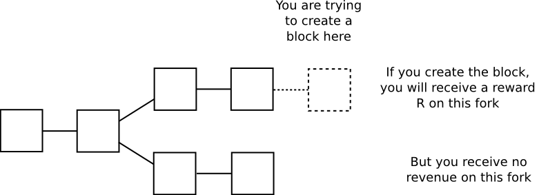
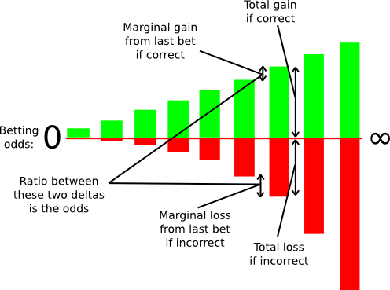
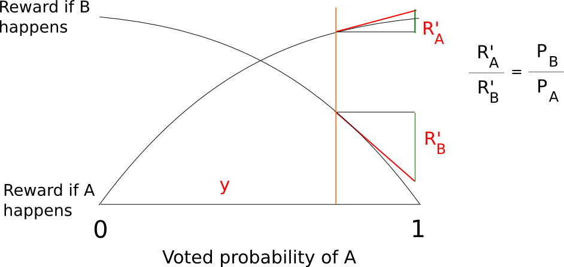
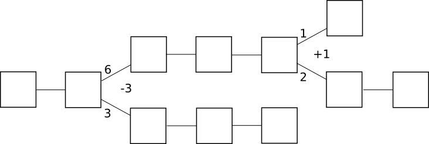
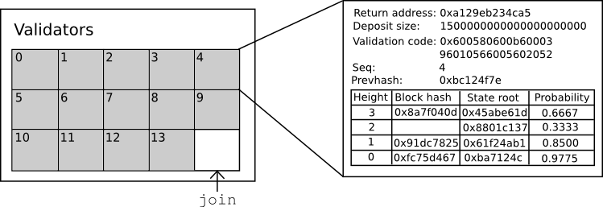
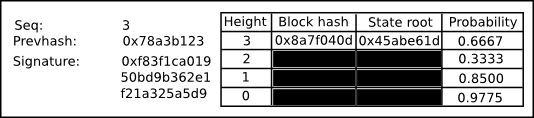
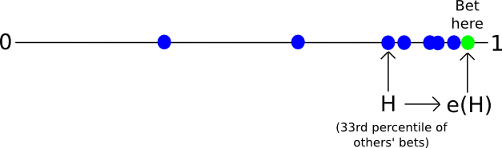

# Understanding Serenity, Part 2: Casper
# 理解Serenity 第二部分: Casper

[Original post](https://blog.ethereum.org/2015/12/28/understanding-serenity-part-2-casper/) by Vitalik Buterin, on December 28th, 2015

**Special thanks to Vlad Zamfir for introducing the idea of by-block consensus and convincing me of its merits, alongside many of the other core ideas of Casper, and to Vlad Zamfir and Greg Meredith for their continued work on the protocol.**

**特别感谢Vlad Zamfir，他提出了按块达成共识这个想法，并且说服我认同它和Casper的其它一些核心想法的价值；以及Vlad Zamfir和Greg Meredith，为他们在这个协议上的持续努力。**

In the last post in this series, we discussed one of the two flagship feature sets of Serenity: a heightened degree of abstraction that greatly increases the flexibility of the platform and takes a large step in moving Ethereum from “Bitcoin plus Turing-complete” to “general-purpose decentralized computation”. Now, let us turn our attention to the other flagship feature, and the one for which the Serenity milestone was originally created: the Casper proof of stake algorithm.

在这个系列的上一篇中，我们讨论了Serenity的两大旗舰特性之一：深度抽象，它将给平台带来极大的灵活性，使以太坊从“比特币加图灵完备”向“通用去中心化的计算”迈进一大步。现在，让我们把注意力转向另一个主要特性，也是当初设立Serenity里程碑的原因：Casper权益证明算法。

## Consensus By Bet
## 投注共识

The keystone mechanism of Casper is the introduction of a fundamentally new philosophy in the field of public economic consensus: the concept of consensus-by-bet. The core idea of consensus-by-bet is simple: the protocol offers opportunities for validators to bet against the protocol on which blocks are going to be finalized. A bet on some block X in this context is a transaction which, by protocol rules, gives the validator a reward of Y coins (which are simply printed to give to the validator out of thin air, hence “against the protocol”) in all universes in which block X was processed but which gives the validator a penalty of Z coins (which are destroyed) in all universes in which block X was not processed.

Casper向公开经济学共识这个领域引入了一个根本上全新的理念作为自己的基础：投注共识。投注共识的核心思想很简单：为验证人(validator)提供**与协议**对赌哪个块会被最终确定的机会。在这里对某个区块X的投注就是一笔交易，在**所有区块X被处理了的世界中**都会带给验证人Y个币的奖励（奖励是凭空“印”出来的，因而是“与协议”对赌），而在所有区块X没有被处理的世界中会对验证人收取Z个币的罚款（罚金被销毁）。

(译注：一个世界(world)在这里应理解为区块链未来的一种可能状态。)

The validator will wish to make such a bet only if they believe block X is likely enough to be processed in the universe that people care about that the tradeoff is worth it. And then, here’s the economically recursive fun part: the universe that people care about, ie. the state that users’ clients show when users want to know their account balance, the status of their contracts, etc, is itself derived by looking at which blocks people bet on the most. Hence, each validator’s incentive is to bet in the way that they expect others to bet in the future, driving the process toward convergence.

只有在相信区块X在人们关心的那个世界中被处理的可能性足够大时，这才是值得去做的交易，验证人才会愿意投注。然而，接下来就是经济上递归的有趣部分：人们关心的那个世界，也就是用户的客户端在用户想要知道他们的账户余额或是合约的状态时所展现的那个状态，**本身就是根据人们对哪个区块投注最多推导出来的**。因此，每一个验证人都具有根据他们所预期的其他人的投注情况进行投注的动机，驱使这个过程走向收敛。

A helpful analogy here is to look at proof of work consensus – a protocol which seems highly unique when viewed by itself, but which can in fact be perfectly modeled as a very specific subset of consensus-by-bet. The argument is as follows. When you are mining on top of a block, you are expending electricity costs E per second in exchange for receiving a chance p per second of generating a block and receiving R coins in all forks containing your block, and zero rewards in all other chains:

一个有帮助的类比是工作量证明共识 - 它本身看起来非常独特，实际上可以成为投注共识的一个特别子模型。理由如下：当你基于一个块挖矿时，你是在花费每秒`E`的电力成本换取每秒`p`的出块概率，并且在**所有包含你的出块的分叉中**获得`R`个币，在其它分叉中分文不得。

Hence, every second, you receive an expected gain of `p*R-E` on the chain you are mining on, and take a loss of E on all other chains; this can be interpreted as taking a bet at `E:p*R-E` odds that the chain you are mining on will “win”; for example, if p is 1 in 1 million, R is 25 BTC ~= $10000 USD and E is $0.007, then your gains per second on the winning chain are 0.000001 * 10000 - 0.007 = 0.003, your losses on the losing chain are the electricity cost of 0.007, and so you are betting at 7:3 odds (or 70% probability) that the chain you are mining on will win. Note that proof of work satisfies the requirement of being economically “recursive” in the way described above: users’ clients will calculate their balances by processing the chain that has the most proof of work (ie. bets) behind it.

因此，每一秒钟，在你挖矿的链上你可以获得`p*R-E`的期望收益，在其它链上遭受`E`的损失；因此你的挖矿选择可以理解为下注赌你所在的链有`E:p*R-E`的相对概率(odds)胜出。比如，假设p等于百万分之一，R是25个币约等于10000美元，而E是0.007美元，则你在胜出链上每秒钟的期望收益是`0.000001 * 10000 - 0.007 = 0.003`，你在失败链上的损失是`0.007`的电力成本，因此你是在赌自己挖矿的链有7:3的相对概率（或者说70%的概率）胜出。注意工作量证明满足上面所说的经济上递归的要求：用户的客户端通过处理拥有最大工作量的那条链来计算其账户余额。

Consensus-by-bet can be seen as a framework that encompasses this way of looking at proof of work, and yet also can be adapted to provide an economic game to incentivize convergence for many other classes of consensus protocols. Traditional Byzantine-fault-tolerant consensus protocols, for example, tend to have a concept of “pre-votes” and “pre-commits” before the final “commit” to a particular result; in a consensus-by-bet model, one can make each stage be a bet, so that participants in the later stages will have greater assurance that participants in the earlier stages “really mean it”.

投注共识可以看作是包含了以特定方式看待的工作量证明的一个框架，也适合为其他多种类型的共识协议提供能促进收敛的经济博弈。例如传统的[拜占庭容错](https://en.wikipedia.org/wiki/Byzantine_fault_tolerance)共识协议中，通常在对某个结果进行最后"commit"之前还有"pre-votes"和"pre-commits"的概念；在投注共识的模型下，我们可以把每一阶段都变成投注，这样后面阶段的参与者就有更大把握相信前面阶段的参与者“真的是这个意思”。

It can also be used to incentivize correct behavior in out-of-band human consensus, if that is needed to overcome extreme circumstances such as a 51% attack. If someone buys up half the coins on a proof-of-stake chains, and attacks it, then the community simply needs to coordinate on a patch where clients ignore the attacker’s fork, and the attacker and anyone who plays along with the attacker automatically loses all of their coins. A very ambitious goal would be to generate these forking decisions automatically by online nodes – if done successfully, this would also subsume into the consensus-by-bet framework the underappreciated but important result from traditional fault tolerance research that, under strong synchrony assumptions, even if almost all nodes are trying to attack the system the remaining nodes can still come to consensus.

投注共识还可以用于激励链外人类共识(out-of-band human consensus)的正确行为，如果为了克服类似51%攻击的极端情况有需要的话。假设有人购买了一条PoS链上超过一半的币，并进行攻击，那么社区只需要协商出一个让客户端忽略攻击者分叉的补丁，就能自动让攻击者和他的小伙伴们失去他们所有的币。一个极有野心的目标是让在线节点可以自动的产生这种分叉决定 - 如果能成功实现，传统容错研究中的一个被低估但却重要的结论 - 在强同步假设下，即使几乎所有节点都在尝试攻击系统，剩下的节点[依然可以达成共识](http://research.microsoft.com/en-us/um/people/lamport/pubs/byz.pdf) - 也可以被纳入投注共识的框架中。

In the context of consensus-by-bet, different consensus protocols differ in only one way: who is allowed to bet, at what odds and how much? In proof of work, there is only one kind of bet offered: the ability to bet on the chain containing one’s own block at odds `E:p*R-E`. In generalized consensus-by-bet, we can use a mechanism known as a scoring rule to essentially offer an infinite number of betting opportunities: one infinitesimally small bet at 1:1, one infinitesimally small bet at 1.000001:1, one infinitesimally small bet at 1.000002:1, and so forth.

在投注共识的情境中，不同的共识协议只在一件事情上有区别：谁，可以以什么赔率，投多少注？工作量证明只提供了一种赌局：投注胜出链有`E:p*R-E`的相对概率包含你自己出的块。在广义的投注共识中，依据一种被称为[评分规则(scoring rule)](https://en.wikipedia.org/wiki/Scoring_rule)的机制我们本质上可以提供无限多种赌局：在1:1上压极小的一注，在1.000001:1上也压极小注，在1.000002:1上也压极小注，如此继续。

One can still decide exactly how large these infinitesimal marginal bets are at each probability level, but in general this technique allows us to elicit a very precise reading of the probability with which some validator thinks some block is likely to be confirmed; if a validator thinks that a block will be confirmed with probability 90%, then they will accept all of the bets below 9:1 odds and none of the bets above 9:1 odds, and seeing this the protocol will be able to infer this “opinion” that the chance the block will be confirmed is 90% with exactness. In fact, the revelation principle tells us that we may as well ask the validators to supply a signed message containing their “opinion” on the probability that the block will be confirmed directly, and let the protocol calculate the bets on the validator’s behalf.

参与者依然可以选择在每一个概率等级上的这些极小边际投注的确切大小，但大体上这个技术让我们能打探出验证人认为某个块会被确认的相当精确的概率读数。如果验证人认为一个块有90%的概率会被确认，那么他们就会接受所有相对概率低于9:1的赌局，拒绝相对概率高于9:1的赌局，而协议就能基于这一点准确得出这个块会被确认的概率是90%的“看法”。事实上，[显示原理(revelation principle)](https://en.wikipedia.org/wiki/Revelation_principle)告诉我们可以要求验证人直接给出他们对某个块被确认概率的“看法”的签名消息，让协议代表验证人计算投注。

Thanks to the wonders of calculus, we can actually come up with fairly simple functions to compute a total reward and penalty at each probability level that are mathematically equivalent to summing an infinite set of bets at all probability levels below the validator’s stated confidence. A fairly simple example is s(p) = p/(1-p) and f(p) = (p/(1-p))^2/2 where s computes your reward if the event you are betting on takes place and f computes your penalty if it does not.

<small>多亏了神奇的微积分，我们可以得到在每一个概率等级上计算总奖励和总惩罚的简单函数，计算结果在数学上等价于根据验证人信心在所有概率等级上形成的投注的无限集合的总和。一个简单的例子是`s(p) = p(1-p)`和`f(p) = (p/(1-p))^2/2`，这里`s`计算如果你投注的事件发生能获得的奖励，`f`计算如果没有发生你受到的惩罚。<small>

A key advantage of the generalized approach to consensus-by-bet is this. In proof of work, the amount of “economic weight” behind a given block increases only linearly with time: if a block has six confirmations, then reverting it only costs miners (in equilibrium) roughly six times the block reward, and if a block has six hundred confirmations then reverting it costs six hundred times the block reward. In generalized consensus-by-bet, the amount of economic weight that validators throw behind a block could increase exponentially: if most of the other validators are willing to bet at 10:1, you might be comfortable sticking your neck out at 20:1, and once almost everyone bets 20:1 you might go for 40:1 or even higher. Hence, a block may well reach a level of “de-facto complete finality”, where validators’ entire deposits are at stake backing that block, in as little as a few minutes, depending on how brave the validators are (and how much the protocol incentivizes them to be).

投注共识的广义形式有一个重要优点。在工作量证明中，给定区块背后的“经济权重”仅仅随着时间线性增加：如果一个块有6个确认，那么要撤销它只需要花费矿工大约6倍于出块奖励（在均衡态下）的成本，而如果一个块有600个确认，那么撤销它的成本就是出块奖励的600倍。在广义的投注共识中，验证人在一个块上投入的经济权重可以指数级增加：如果其他大多数验证人愿意以10:1下注，你可能会想冒险以20:1下注；而一旦几乎所有人都增加到20:1，你可能会跳到40:1或者更高。因此，一个块很可能在几分钟之内，取决于验证人有多少勇气（以及协议提供的激励大小），就达到一种“准最终确定”的状态，这种状态下验证人的所有保证金都成为了支持这个块的投注。

> 50000-foot view summary: the blockchain is a prediction market on itself.
> **在50000英尺的高度看：区块链是一个关于自身的预测市场。**

## Blocks, Chains and Consensus as Tug of War
## 区块，链，共识与拔河

Another unique component of the way that Casper does things is that rather than consensus being by-chain as is the case with current proof of work protocols, consensus is by-block: the consensus process comes to a decision on the status of the block at each height independently of every other height. This mechanism does introduce some inefficiencies – particularly, a bet must register the validator’s opinion on the block at every height rather than just the head of the chain – but it proves to be much simpler to implement strategies for consensus-by-bet in this model, and it also has the advantage that it is much more friendly to high blockchain speed: theoretically, one can even have a block time that is faster than network propagation with this model, as blocks can be produced independently of each other, though with the obvious proviso that block finalization will still take a while longer.

Casper的另一个独特之处在于它的共识是**按块达成的(by-block)**而不是像工作量证明那样**按链达成的(by-chain)**：共识过程在某个高度上对区块状态的决策是独立于其它所有高度的。这个机制确实会导致一定程度的低效 - 特别是，一次投注必须表达验证人对于每一个高度上区块的意见，而不能仅是链的头部区块 - 但是在这个模型下为投注共识实现投注策略会十分简单，而且它还有个优点是对高速区块链友好：理论上，这个模型中的出块时间甚至可以比网络传播时间还要块，因为区块可以相互独立的被制造出来，虽然有个明显的附带条件，即区块的**最终确定**依然要一段时间。

In by-chain consensus, one can view the consensus process as being a kind of tug-of-war between negative infinity and positive infinity at each fork, where the “status” at the fork represents the number of blocks in the longest chain on the right side minus the number of blocks on the left side:

在按链达成的共识中，我们可以把共识过程看作是正无穷和负无穷在每个分叉点进行的拔河游戏，每次分叉的“状态值”的含义是了右手边最长链的区块数减去左边最长链的区块数：

Clients trying to determine the “correct chain” simply move forward starting from the genesis block, and at each fork go left if the status is negative and right if the status is positive. The economic incentives here are also clear: once the status goes positive, there is a strong economic pressure for it to converge to positive infinity, albeit very slowly. If the status goes negative, there is a strong economic pressure for it to converge to negative infinity.

为了找出“正确的链”我们只需从起源块（genesis block）开始前进，在每一个分叉处，如果状态值是负数则往左边移动，反之向右边移动。这里的经济激励很明显：一旦状态值变正，则说明有很强的经济压力迫使它走向正无穷，尽管过程很缓慢。如果状态值变负，则有很强的经济压力迫使它走向负无穷。

Incidentally, note that under this framework the core idea behind the GHOST scoring rule becomes a natural generalization – instead of just counting the length of the longest chain toward the status, count every block on each side of the fork:

顺便说一句，在这个框架下，[GHOST评分规则](https://eprint.iacr.org/2013/881.pdf)的核心思想变成了一种自然的范化：与其只通过最长链的长度来计算状态值，不如计算分叉单边所有块的数量：

In by-block consensus, there is once again the tug of war, though this time the “status” is simply an arbitrary number that can be increased or decreased by certain actions connected to the protocol; at every block height, clients process the block if the status is positive and do not process the block if the status is negative. Note that even though proof of work is currently by-chain, it doesn’t have to be: one can easily imagine a protocol where instead of providing a parent block, a block with a valid proof of work solution must provide a +1 or -1 vote on every block height in its history; +1 votes would be rewarded only if the block that was voted on does get processed, and -1 votes would be rewarded only if the block that was voted on does not get processed:

在按块达成的共识中，同样有这个拔河游戏，不过此时“状态值”仅仅是通过协议的某些操作可以任意增加或者减少的数字。在每一个高度上，如果状态值为正，客户端就处理这个块，如果为负则不处理。注意虽然工作量证明当前是按链达成共识的，但并非必须如此：我们很容易可以想象一个协议，其中一个包含有效工作量证明的区块不引用父区块，而是给它自身历史上的所有区块投一张+1或者-1票。+1票只有在所投的区块被处理时才获得奖励，而-1票只在所投的区块没有被处理时才得到奖励：

Of course, in proof of work such a design would not work well for one simple reason: if you have to vote on absolutely every previous height, then the amount of voting that needs to be done will increase quadratically with time and fairly quickly grind the system to a halt. With consensus-by-bet, however, because the tug of war can converge to complete finality exponentially, the voting overhead is much more tolerable.

不过，在工作量证明中这样的设计无法很好的工作，原因很简单：如果你需要对**每一个**历史高度进行投票，那么需要进行的投票数量会随着时间的平方增长，很快就能让系统宕机。而在投注共识中，由于拔河游戏可以以指数级速度收敛到最终确定，投票的开销要容易承受的多。

One counterintuitive consequence of this mechanism is the fact that a block can remain unconfirmed even when blocks after that block are completely finalized. This may seem like a large hit in efficiency, as if there is one block whose status is flip-flopping with ten blocks on top of it then each flip would entail recalculating state transitions for an entire ten blocks, but note that in a by-chain model the exact same thing can happen between chains as well, and the by-block version actually provides users with more information: if their transaction was confirmed and finalized in block 20101, and they know that regardless of the contents of block 20100 that transaction will have a certain result, then the result that they care about is finalized even though parts of the history before the result are not. By-chain consensus algorithms can never provide this property.

这个机制的一个反直觉结果是，一个块可以在其后的块都最终确定之后依然处于未确认的状态。这看起来像是一个很大的效率问题，因为如果其上有10个块的一个区块状态一直反复变化的话，每一次变动都会导致重新计算这10个块的状态转移，但其实在按链达成的共识中在链与链之间会发生完全相同的事情，而按块的共识实际上可以提供更多的信息给用户：如果他们的交易在第20101个块被确认和最终确定，而且他们知道不管第20100个块的内容是什么，这笔交易都有一个确定的结果，那么他们关心的这个结果就是已经最终确定的，即使结果前的部分历史还不是。按链达成的共识算法永远也不会有这个性质。

## So how does Casper work anyway?
## 那么Casper到底是如何工作的？

In any security-deposit-based proof of stake protocol, there is a current set of bonded validators, which is kept track of as part of the state; in order to make a bet or take one of a number of critical actions in the protocol, you must be in the set so that you can be punished if you misbehave. Joining the set of bonded validators and leaving the set of bonded validators are both special transaction types, and critical actions in the protocol such as bets are also transaction types; bets may be transmitted as independent objects through the network, but they can also be included into blocks.

在所有基于安全准备金的权益证明协议中，都有一群有担保的验证人，这个信息也记录在系统状态中。如果要投注或者进行某一种协议中的关键操作，你必须先加入这个群体，这样才能确保你的恶意行为会被处罚。加入和退出有担保的验证人都是特殊的交易类型，协议的关键操作例如投注同样也是一种交易类型。投注可以作为独立的对象在网络上被传输，也可以被打包进区块之中。

In keeping with Serenity’s spirit of abstraction, all of this is implemented via a Casper contract, which has functions for making bets, joining, withdrawing, and accessing consensus information, and so one can submit bets and take other actions simply by calling the Casper contract with the desired data. The state of the Casper contract looks as follows:

基于Serenity的抽象精神，所有的逻辑都通过一个**Casper合约**来实现，它提供投注，加入，取款和获取共识信息等一系列功能，因此通过简单的调用Casper合约我们就能提交投注或者进行其他操作。Casper合约的内部状态看起来是这个样子：

The contract keeps track of the current set of validators, and for each validator it keeps track of six primary things:

这个合约会记录当前的验证人集合，对于每位验证人记录6项主要数据：

* The return address for the validator’s deposit
* The current size of the validator’s deposit (note that the bets that the validator makes will increase or decrease this value)
* The validator’s validation code
* The sequence number of the most recent bet
* The hash of the most recent bet
* The validator’s opinion table

* 验证人保证金的返还地址
* 当前验证人保证金的数量（注意验证人的投注会使这个值增加或减少）
* 验证人的**验证代码(validation code)**
* 最近一次投注的序号
* 最近一次投注的hash
* 验证人的**意见**表

The concept of “validation code” is another abstraction feature in Serenity; whereas other proof of stake protocols require validators to use one specific signature verification algorithm, the Casper implementation in Serenity allows validators to specify a piece of code that accepts a hash and a signature and returns 0 or 1, and before accepting a bet checks the hash of the bet against its signature. The default validation code is an ECDSA verifier, but one can also experiment with other verifiers: multisig, threshold signatures (potentially useful for creating decentralized stake pools!), Lamport signatures, etc.

“验证代码”概念是Serenity的另一个抽象特性。其他的权益证明协议会要求验证人使用某一种特定的签名验证算法，而Serenity的Casper实现允许验证人定制一段代码，这段代码可以接受一个hash和一个签名做参数，返回0或者1，在投注被接受之前，代码就可以用签名来验证投注的hash正确无误。默认的验证代码是一个椭圆曲线签名验证算法，你可以试验其它的算法：多重签名，threshold signature（有发展成去中心化资金池的潜力！），Lamport signature（译注：可抵御量子计算机）等等。

Every bet must contain a sequence number one higher than the previous bet, and every bet must contain a hash of the previous bet; hence, one can view the series of bets made by a validator as being a kind of “private blockchain”; viewed in that context, the validator’s opinion is essentially the state of that chain. An opinion is a table that describes:

每一次投注都必须包含一个比上一次投注大1的序号，而且每次投注必须包含上次投注的hash。因此，你可以把某位验证人的一系列投注看作是某种“私有链”；这样理解的话，验证人的意见实际上是这条链的状态。验证人意见是描述如下问题的一张表格：

* What the validator thinks the most likely state root is at any given block height
* What the validator thinks the most likely block hash is at any given block height (or zero if no block hash is present)
* How likely the block with that hash is to be finalized

* 在每一个高度，验证人认为哪个是最佳的状态树根节点
* 在每一个高度，验证人认为哪个是最佳的区块hash（如果还没有区块hash产生可以给0）
* 该hash对应的区块有多大概率被最终确定

A bet is an object that looks like this:

一次投注是看起来如下的一个对象：

The key information is the following:

这里的关键信息是：

* The sequence number of the bet
* The hash of the previous bet
* A signature
* A list of updates to the opinion

* 投注的序号
* 上次投注的hash
* 签名
* 意见更新组成的列表

The function in the Casper contract that processes a bet has three parts to it. First, it validates the sequence number, previous hash and signature of a bet. Next, it updates the opinion table with any new information supplied by the bet. A bet should generally update a few very recent probabilities, block hashes and state roots, so most of the table will generally be unchanged. Finally, it applies the scoring rule to the opinion: if the opinion says that you believe that a given block has a 99% chance of finalization, and if, in the particular universe that this particular contract is running in, the block was finalized, then you might get 99 points; otherwise you might lose 4900 points.

Casper合约中处理投注的函数有三个部分。首先，它会验证投注的序号，上次投注的hash和投注签名。然后它会用投注中的新信息来更新验证人的意见表。一次投注通常只会有少数概率，区块hash和状态树根节点更新，因此意见表的大部分不会变化。最后，它会对意见表应用评分规则：如果你的意见是相信某个块有99%的机会被最终确定，并且，如果在该特定合约运行的特定世界中，这个块被最终确定了，你将会得到99分，否则你会失去4900分。

Note that, because the process of running this function inside the Casper contract takes place as part of the state transition function, this process is fully aware of what every previous block and state root is at least within the context of its own universe; even if, from the point of view of the outside world, the validators proposing and voting on block 20125 have no idea whether or not block 20123 will be finalized, when the validators come around to processing that block they will be – or, perhaps, they might process both universes and only later decide to stick with one. In order to prevent validators from providing different bets to different universes, we have a simple slashing condition: if you make two bets with the same sequence number, or even if you make a bet that you cannot get the Casper contract to process, you lose your entire deposit.

需要注意的是，由于Casper合约的这个函数是作为状态转移函数的一部分被执行的，**执行过程完全清楚之前的每一个区块和状态树根节点是什么**，至少在它自己所在的世界中是这样。即使从外部世界来看，对第20125个块进行提议和投票的验证人不知道第20123个块是否会被最终确定，但是当验证人**处理到**那个块的时候他们就知道了 - 或者，他们可能两个世界都处理，然后在决定要跟随哪一个。为了防止验证人在不同的世界中提供不同的投注，我们还有一个简单严格的条款：如果你有两次投注序号一样，或者说你提交了一个无法让Casper合约处理的投注，你将失去所有保证金。

Withdrawing from the validator pool takes two steps. First, one must submit a bet whose maximum height is -1; this automatically ends the chain of bets and starts a four-month countdown timer (20 blocks / 100 seconds on the testnet) before the bettor can recover their funds by calling a third method, withdraw. Withdrawing can be done by anyone, and sends funds back to the same address that sent the original join transaction.

从验证人资金池取款需要两个步骤。首先，你需要提交一个最大高度为-1的投注；它会自动完结投注链，并且启动一个为期四个月的倒计时（在testnet上是20个块/100秒），这之后投注人才能通过调用另一个方法，`withdraw`，来收回他的资金。任何人都可以触发取款，资金会被发送回之前发送`join`交易的那个地址。

## Block proposition
## 区块提议

A block contains (i) a number representing the block height, (ii) the proposer address, (iii) a transaction root hash and (iv) a signature. For a block to be valid, the proposer address must be the same as the validator that is scheduled to generate a block for the given height, and the signature must validate when run against the validator’s own validation code. The time to submit a block at height N is determined by T = G + N * 5 where G is the genesis timestamp; hence, a block should ordinarily appear every five seconds.

每个区块都包含 (i) 一个代表区块高度的数字， (ii) 提议人的地址，(iii) 交易树根节点hash和 (iv) 提议人签名。一个有效区块的提议人地址必须是协议安排在这个高度出块的验证人的地址，而签名则必须能通过该验证人的验证代码验证。高度为N的区块的提交时间由公式`T = G + N*5`确定，其中`G`是起源块的时间戳。因此，一般来说每5秒中会出现一个新块。

An NXT-style random number generator is used to determine who can generate a block at each height; essentially, this involves taking missing block proposers as a source of entropy. The reasoning behind this is that even though this entropy is manipulable, manipulation comes at a high cost: one must sacrifice one’s right to create a block and collect transaction fees in order to manipulate it. If it is deemed absolutely necessary, the cost of manipulation can be increased several orders of magnitude further by replacing the NXT-style RNG with a RANDAO-like protocol.

一个NXT风格的随机数发生器被用来决定在每个高度应该由谁来出块，不可避免的，缺失的出块人也会作为熵的一个来源。采取这个方案背后的原因是虽然这个熵是可操纵的，操纵的代价非常高：你必须放弃创建一个块能收取的交易费用收益。如果确实有必要，我们也可以用类似[RANDAO]的协议取代NXT风格的随机数发生器，将这个代价进一步加大数个级别。

## The Validator Strategy
## 验证人策略

So how does a validator operate under the Casper protocol? Validators have two primary categories of activity: making blocks and making bets. Making blocks is a process that takes place independently from everything else: validators gather transactions, and when it comes time for them to make a block, they produce one, sign it and send it out to the network. The process for making bets is more complicated. The current default validator strategy in Casper is one that is designed to mimic aspects of traditional Byzantine-fault-tolerant consensus: look at how other validators are betting, take the 33rd percentile, and move a step toward 0 or 1 from there.

那么在Casper协议下作为验证人该如何行动呢？验证人有两类主要活动：出块和投注。出块是一个独立于其它所有事件而发生的过程：验证人收集交易，当轮到他们的出块时间时，他们就制造一个区块，签名，然后发送到网络上。投注的过程更为复杂一些。目前Casper默认的验证人策略被设计为模仿传统的拜占庭容错共识：观察其他的验证人如何投注，取33%处的值，向0或者1进一步移动。

To accomplish this, each validator collects and tries to stay as up-to-date as possible on the bets being made by all other validators, and keeps track of the current opinion of each one. If there are no or few opinions on a particular block height from other validators, then it follows an initial algorithm that looks roughly as follows:

为了实现这个策略，每一位验证人都要收集其他验证人的投注，并且尽可能保持该数据处于最新状态，用于跟踪每一位验证人的当前意见。如果某个高度上还没有或者只有很少的其他验证人发表了意见，那么我们用大致如下的算法来处理：

* If the block is not yet present, but the current time is still very close to the time that the block should have been published, bet 0.5
* If the block is not yet present, but a long time has already passed since the block should have been published, bet 0.3
* If the block is present, and it arrived on time, bet 0.7
* If the block is present, but it arrived either far too early or far too late, bet 0.3

* 如果这个高度的块还没有出现，且当前时间离这个块应该出现的时间过去不久，则预计概率为0.5
* 如果这个高度的块还没有出现，且离这个块应该出现的时间过去了很长时间，则预计概率为0.3
* 如果这个高度的块已经出现，且按时出现，则预计概率为0.7
* 如果这个高度的块已经出现，但是出现时间过早或者过晚，则预计概率为0.3

Some randomness is added in order to help prevent “stuck” scenarios, but the basic principle remains the same.

这个过程还会增加一些随机性来防止“卡住”的场景，但是基本原则是一样的。

If there are already many opinions on a particular block height from other validators, then we take the following strategy:

如果对某个高度其他验证人已经发布了许多意见，那么我们使用如下策略：

* Let L be the value such that two thirds of validators are betting higher than L. Let M be the median (ie. the value such that half of validators are betting higher than M). Let H be the value such that two thirds of validators are betting lower than H.
* Let e(x) be a function that makes x more “extreme”, ie. pushes the value away from 0.5 and toward 1. A simple example is the piecewise function e(x) = 0.5 + x / 2 if x > 0.5 else x / 2.
* If L > 0.8, bet e(L)
* If H < 0.2, bet e(H)
* Otherwise, bet e(M), though limit the result to be within the range [0.15, 0.85] so that less than 67% of validators can’t force another validator to move their bets too far>

* 设三分之二验证人的预计高于概率`L`；`M`为预期的中位数（即有一半验证人的估值高于`M`）；三分之二验证人的预计低于概率`H`。
* 设`e(x)`是一个让`x`更“极端”的函数，例如让数值远离0.5走向1。一个简单的例子是这个分段函数：`e(x) = 0.5 + x/2 if x > 0.5 else x/2`.
* 如果 `L > 0.8`, 则预计概率为`e(L)`
* 如果 `H < 0.2`, 则预计概率为`e(H)`
* 其他情况，预计概率为`e(M)`, 但是结果不能超出`[0.15, 0.85]`这个区间，因此少于67%的验证人无法强迫其他的验证人大幅调整其预计。

Validators are free to choose their own level of risk aversion within the context of this strategy by choosing the shape of e. A function where f(e) = 0.99999 for e > 0.8 could work (and would in fact likely provide the same behavior as Tendermint) but it creates somewhat higher risks and allows hostile validators making up a large portion of the bonded validator set to trick these validators into losing their entire deposit at a low cost (the attack strategy would be to bet 0.9, trick the other validators into betting 0.99999, and then jump back to betting 0.1 and force the system to converge to zero). On the other hand, a function that converges very slowly will incur higher inefficiencies when the system is not under attack, as finality will come more slowly and validators will need to keep betting on each height longer.

在这个策略中，验证人可以自由的通过改变`e`的形状来选择他们自己的风险厌恶程度。选一个在`x > 0.8`时`e(x) = 0.99999`的函数也可以（而且很可能产生和Tendermint一样的行为），但是它有更高的风险，如果占有了担保资金一大部分的验证人是恶意的，他们只需要很低的成本，就能设计让使用该`e`函数的验证人损失全部保证金（攻击策略为先预计概率为0.9，引诱其他验证人预期0.99999，然后突然改为预计0.1，迫使系统预期收敛到0）。另一方面，一个收敛很慢的函数会导致系统在没有遭受攻击的情况下更低效，因为最终确定会更慢，且验证人对每个高度的投注需要持续更久。

Now, how does a client determine what the current state is? Essentially, the process is as follows. It starts off by downloading all blocks and all bets. It then uses the same algorithm as above to construct its own opinion, but it does not publish it. Instead, it simply looks at each height sequentially, processing a block if its probability is greater than 0.5 and skipping it otherwise; the state after processing all of these blocks is shown as the “current state” of the blockchain. The client can also provide a subjective notion of “finality”: when the opinion at every height up to some k is either above 99.999% or below 0.001%, then the client considers the first k blocks finalized.

现在，作为`客户端`要如何确定当前状态呢？过程基本如下：一开始先下载所有的区块和投注，然后用上面的算法来形成自己的意见，但是不公布意见。它只要简单的按顺序在每个高度进行观察，如果一个块的概率高于0.5就处理它，否则就跳过它。在处理所有的区块之后得到的状态就可以显示为区块链的“当前状态”。客户端还可以给出对于“最终确定”的主观看法：当高度`k`之前的每个块，意见要么高于99.999%或者低于0.001%，那么客户端就可以认为前`k`个块已经最终确定。

## Further Research
## 进一步的研究

There is still quite a bit of research to do for Casper and generalized consensus-by-bet. Particular points include:

Casper和一般化的投注共识还需要大量研究。特别包括以下几个方面：

* Coming up with results to show that the system economically incentivizes convergence, even in the presence of some quantity of Byzantine validators
* Determining optimal validator strategies
* Making sure that the mechanism for including the bets in blocks is not exploitable
* Increasing efficiency. Currently, the POC1 simulation can handle ~16 validators running at the same time (up from ~13 a week ago), though ideally we should push this up as much as possible (note that the number of validators the system can handle on a live network should be roughly the square of the performance of the POC, as the POC runs all nodes on the same machine).

* 给出能表明这个系统在经济上会激励收敛的成果，即使有一些拜占庭验证人的存在。
* 找出最佳的验证人策略
* 确保把**投注打包进区块**的机制没有漏洞
* 提高效率。目前的概念原型(POC1)能模拟大约16个验证人同时运行，理想情况下这个数字应该越高越好（注意系统在**生产网络**能处理的验证人数量大约是概念原型性能的平方，因为概念原型把所有节点都运行在一台机器上）。

The next article in this series will deal with efforts to add a scaffolding for scalability into Serenity, and will likely be released around the same time as POC2.

该系列的下一篇文章会介绍Serenity可伸缩性方面的工作，估计会和Serenity的第二个概念原型(POC2)同时发布。
