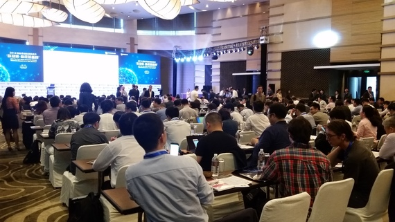

[Origin Post](https://blog.ethereum.org/2015/10/18/vitaliks-research-and-ecosystem-update/)

Posted by Vitalik Buterin on October 18th, 2015.

Over the last five days, myself, our executive director Ming Chan, and several others from the Ethereum team and Ethereum-based projects and businesses including Maker, String/Dfinity and Consensys have been visiting China and Hong Kong, where there have been a series of back-to-back conferences and events most notably including the Blockchain Workshop in Hong Kong on Oct 11-13 and the “First Global Blockchain Summit” in Shanghai organized by our friends at Wanxiang on Oct 15-16, while at the same time continuing to work on our usual tasks of research, development, planning DEVcon and administrative matters.

**过去五天，我，我们的执行主管Ming Chan，还有以太坊, [Maker](http://makerdao.com/), [String/Dfinity](http://dfinity.io/)以及[Consensy](http://consensys.net/)团队中的一些成员参加了在中国大陆和香港举行的一系列会议和活动。其中最重要的要数10月11-13日在香港举行的[Blockchain Workshop](http://blockchainworkshops.org/)，以及由[万向集团](http://www.wanxiang.com.cn/product/index.asp)的朋友们于10月15-16日在上海举办的[首届全球区块链峰会](http://www.hbrchina.org/150922/index.shtml)了。这段时间中包括研究，开发，计划准备开发者大会以及行政性事务在内的日常工作也在正常进行。**

Both conferences proved to be, at least in my own admittedly optimistic estimation, highly positive signs of the growth in the Ethereum ecosystem. At the Hong Kong event, on the first day we participated in semi-closed sessions on issues such as decentralized governance, identity and reputation and regulatory compliance. Robin Hanson brought up the topic of prediction markets as a form of “low-cost micro-governance”: if there are situations where a legal or arbitration process is required in order to ultimately resolve disputes, use a prediction market to provide the result instead, only occasionally escalating to the underlying arbitration mechanism. Anyone with private information has the incentive to participate in the prediction market: the parties to the dispute themselves, any third parties involved, and even firms like Google applying top-of-the-line machine learning algorithms; in most cases, a result that accurately predicts the result that would be obtained by the underlying court or arbitration system should be attainable very cheaply.

从我这个乐观的人看来，这两个会议都证明了以太坊生态系统正在健康成长。在香港的会议的第一天，我们参加了半封闭式的会议，讨论的主题包括去中心化的管理、身份和信誉以及合规问题。罗宾·汉森带来了预测市场作为一种“低成本微管理”形式的主题。“低成本微管理”是指利用预测市场代替法律和仲裁以解决纠纷，只在少数必要情况下升级至仲裁途径。任何拥有私有信息的人都有动机参与预测市场：纠纷双方、任何卷入纠纷的第三方，甚至是像谷歌这样运用一流的机器学习算法的公司。在大多数情况下，预测市场应该能以非常低的成本获得法庭或仲裁系统相同的结果。

The next two days consisted of panel discussions on technical and philosophical topics, people discussing their own projects, and the future of blockchains in areas like reputation and internet of things. Ethereum was mentioned many times – not through us marketing ourselves, but by many individuals who see Ethereum as a worthwhile technology on which to build their applications.

在接下来的两天，主要是关于技术和哲学方面的专题讨论，参会者讨论他们自己的项目和区块链在信誉和物联网等领域的未来。以太坊被多次提到--并不是我们在推销以太坊，而是许多参会者认为以太坊是创建他们自己的应用的不错技术。

The Shanghai conference was equally impressive. This was also a two-day event, with the first day featuring back-to-back public speeches and panels and the second day focusing on topic-focused sessions; I personally was involved in moderating the technical discussions on consensus and scalability. This was a fairly large event, perhaps the largest since the Global Bitcoin Summit in Beijing which was my first experience with China over one year before and, as has happened over the same period in the West, the audience has transformed to be more mainstream: rather than just employees of Bitcoin-specific (or even crypto-specific) projects attending, we saw representatives from major banks, government officials, Intel, Huawei and others from traditional industry there.

上海的会议同样令人印象深刻。它也是为期两天的会议，第一天是连续的主题演讲和专题讨论，第二天是专注于某些主题的会议讨论。我主持了关于共识和扩展性主题的技术讨论。这是一场规模相当宏大的会议，可能是自去年北京全球比特币峰会以来最大的会议，就像同一时期在西方举办的会议，参会者是主流人群，而不像以前的会议那样只有比特币相关项目成员，我们看到了来自大型银行、政府官员、英特尔、华为的代表和其他传统行业的代表。

People seem excited to see how they could adopt blockchain technology for their own use – and there was plenty of interest to go around regarding Ethereum specifically. It is indeed true that there are legal restrictions, some fairly clear and some gray, limiting the potential for adoption of Bitcoin or cryptocurrencies in China, but there are as yet no issues whatsoever with blockchain technology. The days before and after the conference, we took the time to meet Wanxiang as well as the other groups in China that we have regular contact with, particularly both myself and Ming meeting for the first time the wonderful team at http://ethfans.org/. We are still determining how we can work with Chinese individuals and business and make Ethereum as useful as possible in what has become by purchasing power parity the largest economy in the world, but it is clear that the possibilities and the potential are great.

人们似乎对看到区块链技术如何应用到自己的行业中感到兴奋 -- 许多人对以太坊格外感兴趣。在中国的确有法律限制，公开限制和隐性的限制，阻碍了比特币或者密码学货币在中国的流行，但是区块链技术不存在这个问题。在会议前后，我们与万向公司以及其它我们经常保持联系的中国团队见面交流，尤其是我和Ming第一次见到了[ethfans.org](http://ethfans.org)的团队成员。我们仍然在考虑应该如何与中国的个人和商业组织合作，使得以太坊可以在这个已经成为世界上最大经济体（按照购买力平价计）的国度尽可能地发挥效用，显而易见的是这里存在着巨大的可能性和潜力。

## Research and Protocol Development

## 底层协议方面的进展

We have identified four key areas of research regarding the underlying protocol that we feel represent the key milestones standing in the way between Ethereum as it currently exists and crypto-utopia:

在通往密码学乌托邦的路上，我们已经确立了底层协议的四个主要研究方向, 作为开发进度的关键里程碑：

* zk-SNARK integration: integrating, whether through a new opcode or ideally by leveraging the EVM’s existing 256-bit modular arithmetic, the ability for Ethereum contracts to verify succinct zero-knowledge proofs. Given that the verification keys can be generated entirely off-chain, this is somewhat easier than it looks, though once implemented quite a bit of infrastructural work will be needed to make it extremely useful. An initial goal will be to use it to implement ultra-private coin mixing as well as a privacy-preserving reputation (“here’s a proof showing that I have a score of over 250 according to your reputation scoring metric and using this set of data published to the blockchain, so you should trust me, but I won’t reveal which of the parties that you should trust I am”) and two-party financial contracts, and the longer-term goal will be an implementation of Hawk on Ethereum; at and outside the above-mentioned conferences, we have had some productive chats with some of the developers of these technologies on how to move forward on accomplishing this.

* 整合zk-SNARK: 通过新指令(opcode)或者更理想的，利用EVM(以太坊虚拟接)现有的256位模运算指令，让以太坊合约获得验证succinct zero-knowledge proof的能力。由于verification key可以在链下生成，这个任务比看上去要容易些，虽然要达到相当的实用程度还需要很多其他方面的工作。我们最初始的目标是利用这个功能来实现超安全混币(ultra-private coin mixing)功能，一个私密名誉系统(privacy-perserving reputation: "哈罗，这里是我的积分超过250的证明，但是我不用告诉你我是谁。"), 以及两方金融合约。长远的目标则是在以太坊上实现[Hawk](http://oblivm.com/hawk/)。在前面提到的会议上以及会议外，我们与这些技术的一些相关开发者非常有成效的讨论了我们应该如何推进和达成这些目标。

* Casper: Ethereum’s proof of stake algorithm now under development by Vlad Zamfir with help from Lucius Greg Meredith, myself and several others. The key components include by-block instead of by-chain consensus and the concept of “economic consensus by bet” as a way of approaching de-facto finality with exponential speed rather than linear speed as is the case with proof of work. The goal is to combine a block time reduction (my personal opinion is that 4 seconds will likely prove to be an good balance between safety and resource overconsumption and centralization risk; Vlad is as usual more aggressive), finality and much lower energy consumption (and 10-100x lower price-of-anarchy generally). Currently, Vlad and Greg are working on formally describing and implementing the non-economic part of the algorithm to mathematically prove convergence properties, and the second step will be optimizing the economics.

* Casper: Casper是以太坊将要采用的POS算法，正在Vlad Zamfir的领导下进行开发，Lucius Greg Meredith, 我和其他一些人提供帮助。关键部分包括用于替代“链共识”的“块共识”(by-block instead of by-chain)，以及“基于投注的经济共识”，以使区块链的确认速度相对于POW的线性效率，达到指数级。我们的目标是同时实现更短的出块时间(我个人认为4秒会是一个平衡安全性，资源浪费以及中心化风险的选择，Vlad则一如往常的更激进些)，更好的确认机制，以及大幅降低能量消耗（大约10-100倍的降低[price-of-anarchy](https://en.wikipedia.org/wiki/Price_of_anarchy))。目前Vlad和Greg正在形式化定义和实现算法中的非经济部分，试图在数学上证明算法的收敛性质。下一步会试图优化经济部分。

* Scalability: using a combination of sharding schemes, random sampling, heavy use of Merkle proofs and asynchronous calling in order to increase the potential transaction throughput from ~10-20 transactions per second to over 100000 (or, if super-quadratic versions are used, a theoretically unlimited number). The basic concepts behind scaling have been set in stone for over six months, and our research team is highly confident that the general approach is valid; what remains is the details of exactly how to make optimal tradeoffs that preserve as much of Ethereum 1.0’s functionality as possible in a scalable context. A key design goal is to make sure the Ethereum 2.0 remains a superset of Ethereum 1.0; for example, synchronous calls should still be possible within a single shard, though cross-shard calls may require asynchrony. I plan on updating my scalability paper to make it more focused, readable and updated with the latest ideas over the next month or so, though in general scalability research is on the back-burner until Casper is solidified.

* 可伸缩性: 我们试图结合分片(sharding), 随机采样，Merkle证明和异步调用，来将事务处理吞吐量从10~20个事务每秒提高到超过100000个每秒（如果super-quadratic versions也用上，理论上吞吐量可以达到无限大）。可伸缩性改进的基本想法在六个月前就已经确立，我们的研发团队对这个设计有非常强的信心。现在的关键是如何调整细节以使得在这个可伸缩设计中尽可能多的保留以太坊1.0的功能。例如，在相同的分片中应该依旧可以使用同步调用，但是跨分片的调用则只能是异步的。我计划更新[我的可伸缩性论文](http://github.com/vbuterin/scalability_paper)，以加入更多最新的变动。

* EVM upgrades: Martin Becze has taken the lead on exploring WebAssembly as a candidate for an upgraded Ethereum virtual machine. WebAssembly shares many properties with the EVM: the need to run untrusted code, the need for code to be very small, and the need to have multiple compatible implementations, though it lacks gas counting. WebAssembly can be used to create a just-in-time compiler for the EVM, drastically speeding up the ethereum js implementation, and it can also potentially be used as a virtual machine option itself by adding a transformation step that adds a gas subtracting instruction to code before every jump operation. Environment opcodes like BLOCKHASH, SSTORE, etc can be abstracted away by turning them into an ABI over a generic foreign function interface (eg. SSTORE(k, v) becomes FFI(0x55 ++ k ++ v) where 0x55; would be the marker representing SSTORE).

* EVM升级: Martin Becze正领导着将[WebAssembly](https://en.wikipedia.org/wiki/WebAssembly)作为升级版以太坊虚拟机候选项的研究。WebAssembly与EVM有许多相似之处：它们都需要运行不可信的代码，都要求代码尽量短小，都需要多个互相兼容的实现。WebAssembly唯一缺的就是Gas的计算。我们也许可以用WebAssembly来做EVM的JIT编译器，这可以极大的提高ethereum js的运行速度。也有可能直接将其做为虚拟机，只要增加一个transformation步骤，在每一个jump指令之前加入一条扣除Gas的指令。诸如`BLOCKHASH`, `SSTORE`之类的环境指令可以被抽象出去，通过FFI来调用。例如：`SSTORE(k, v)`变成`FFI(0x55 ++ k ++ v)`, 这里`0x55`代表`SSTORE`)。

Aside from this, research questions remain on middleware “on top of” Ethereum, including on-chain services, decentralized governance, identity and reputation, random number generation, formal verification for Solidity (we have found a talented team in London that is excited about starting to explore the subject) and prediction market implementations, as well as on projects that may live “alongside” Ethereum (eg. Whisper), though the foundation is leaving it to the community to do much of this extra work as we have deliberately undertaken a strategy of focusing on the core (and doing so in a very lightweight fashion).

除此之外，要研究的问题还存在于以太坊平台之上的中间层，包括on-chain services，去中心化管理，身份和信誉系统，随机数生成，Solidity的形式化验证(伦敦有一个很棒的团队对此很有兴趣，已准备开始探索），预测市场的实现，以及和以太坊并列的一些项目(例如Whisper)。不过以太坊基金会会将这里的大部分工作留给社区完成，因为基金会的策略正在转向聚焦核心功能。

Regarding Homestead, the Homestead milestone has always been somewhat arbitrary in its definition; unlike Frontier, which is marked by a grand and ceremonious launch of the blockchain, and Metropolis, which is marked by the release of Mist, Homestead was always simply meant to be the point where we go from saying “Ethereum is unsafe” to “Ethereum is somewhat safe”. Over the last two months, we have released a wallet, alphas for state tree pruning in pyethereum and cpp-ethereum and headers-first syncing in Go, upgrades to Solidity, very early work in the “light ethereum sub-protocol” (LES) and are soon releasing the 1.0 versions of cpp-ethereum and Mix.

不同于Frontier(在此阶段以太坊区块链的正式发布）和Metropolis（在此阶段Mist发布），Homestead里程碑没有显著的标志性事件。Homestead标志着以太坊从“不安全”转换到“足够安全”。在过去的两个月中，我们已经发布了一个钱包，在pyethereum以及cpp-ethereum中实现了状态树减枝的测试版，在go-ethereum中实现了headers-first同步， 升级了Solidity，启动了“轻以太坊子协议”（light ethereum sub-protocol，LES）的工作，并将很快发布1.0版的C++客户端和Mix。

Our internal target has been to launch Homestead when the Frontier network has successfully run without serious problems for 4 weeks (the “serious problem” threshold being downgraded from the Frontier definition of “consensus failure” to a more expanded definition which is something like “consensus failure OR people losing large amounts of money OR semi-serious network glitches”); we plan on announcing a more detailed strategy for Homestead soon but suffice it to say that we are already mostly there.

我们的目标是：当Frontier网络连续四周运行不出现严重问题（严重问题指共识失败，或者用户丢失大量以太币，或者中等程度的网络故障）时，我们将发布Homestead。我们将会发布进入Homestead阶段的详细策略，现在可以说的是，我们已经非常接近Homestead阶段了。

DEVcon is still slated for November 9-13 in London, and we are looking forward to seeing everyone there!

开发者大会将在于11月9-13日在伦敦举行，我们期待见到各位！
