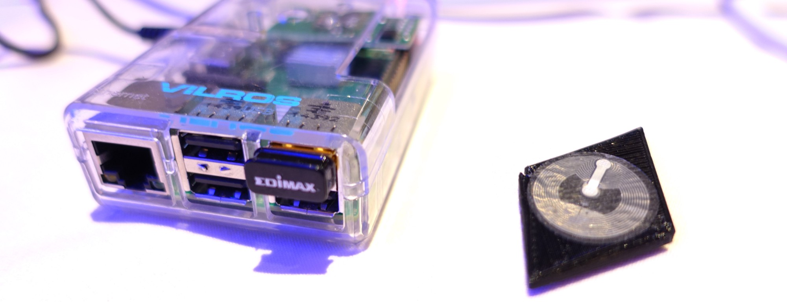

# We're building the Ethereum Computer

[Origin post](https://blog.slock.it/we-re-building-the-ethereum-computer-9133953c9f02) by Stephan Tual, on Dec. 10th, 2015

... and it’s going to be awesome: A tiny, preinstalled, preconfigured home server running both an optimized Ethereum node and exciting new decentralised applications, including Mist.

它会是一个**很棒的设备**：运行了做过优化的[以太坊](https://ethereum.org/)节点和令人激动的去中心化应用的，一个小型的完全配置好的家用服务器，包括[Mist](http://ethfans.org/topics/78)。

The Ethereum Computer is putting identity, funds and personal information back under the users’ control, and we think it’s going to change everything.

以太坊计算机(Ethereum Computer)将身份，资金，个人信息的控制权交还到用户手中，我们觉得它将会改变一切。

## What's the Ethereum Computer?
## 什么是以太坊计算机?

It’s the easiest entry point to the world of Ethereum, without having to struggle setting up a client, buying ether from an exchange (it will come preloaded with enough to get started) or worrying about security updates.

它是通往以太坊世界的捷径，没有繁琐的设置，不需要在交易所购买以太就能使用，没有安全更新的烦恼。

Think of a little box that manages your permissions and identity, with strong encryption and permission control. Inside you’ll find a web3 identity vault, a Slock gateway to your IoT, and even experimental software like an IPFS server to rent your unused hard drive space — automatically.

想象一下，一个加密的能帮你管理权限和身份的小盒子，你可以在里面发现web3身份ID仓库，一个通向物联网的Slock网关，甚至诸如IPFS服务器这样的实验性软件，它可以自动的出租你空闲的硬盘空间！

* It’s the easier way to browse Dapps.
* It’s a secure gatekeeper between the web & web3 to your home or small office IoT, communicating wirelessly with your smart objects.
* And it’s also a brilliant development platform, packaging all the software needed to build Ethereum Dapps as part of a straightforward, optimized image.

* 它让你更容易使用Dapp。
* 它是互联网与你本地智能家居网络之间的安全网关，通过无线方式与你的智能硬件通信。
* 它还是一个极好的开发平台，把所有构建以太坊应用所需要的软件都优化打包在一个镜像里。

## Use cases
## 应用场景

We want to put the Ethereum Computer into as many hands as possible, and bring decentralized technology to the mainstream.

我们希望让尽可能多的人拥有以太坊计算机，把去中心化技术变成主流。

### Home automation, meet e-commerce
### 当家庭自动化遇上电子商务

Enable your entire home to communicate with the blockchain: rent your flat, or share any Slock.it enabled smart object directly and securely.

让你的整个家都能与区块链通信：出租你的公寓，或者安全的分享（出租）任何装有Slock的智能物品。

Any object that’s using ZigBee, Z-Wave, Bluetooth LE or Wi-Fi will likely be able to interact with the Ethereum Computer. When it comes to powering up a ‘dumb’ object, it will be a case of retrofitting it using smart plugs.

任何支持[ZigBee](http://www.zigbee.org/), [Z-Wave](http://www.z-wave.com/), [Bluetooth LE](https://en.wikipedia.org/wiki/Bluetooth_low_energy)或者Wi-Fi的物品基本上都可以和以太坊计算机交互。如果你想要连接不那么智能的硬件，可以使用[智能插座](http://aeotec.com/z-wave-plug-in-switch)。

Long term, we’d love to see deeper integration of our technology with white goods. If you’re wondering why it could be useful for your washing machine to talk to the Blockchain, have a look at this article. (hint: it’s about your privacy).

长远来说，我们希望看到我们的技术被整合进白色家电。如果你想知道为什么把你的洗衣机放到区块链上是件很有用的事情，请读读[这篇文章](https://medium.com/ursium-blog/the-end-of-big-data-a-reasonable-internet-of-things-ff78a4428ed7#.vu1t77i23)。（提示：和你的隐私有关）

### Try out new, exciting applications
### 尝试最新最酷的应用

The Ethereum Computer is a full blown implementation of the Ethereum stack, and therefore can serve any Dapp via HDMI out to your home theater.

以太坊计算机是一个全功能的以太坊套件，由此你可以用HDMI线把它连上你的家庭影院来使用Dapp应用。

If you’d rather use your own machine, you probably noticed current Dapps often require you to trust them with relaying your instructions correctly to the Ethereum network via their web interfaces. This is rather ironic (and dangerous!) considering Ethereum was designed with removing the need for trusted third parties in mind.

如果你更喜欢使用电脑，你可能注意到了一些Dapp会要求你信任它们，通过它们的web界面把你的指令正确的转发给以太坊网络。考虑到以太坊本来就是为了去除对[第三方的信任](http://szabo.best.vwh.net/ttps.html)而设计的，这是多么的讽刺（和危险）。

You can simply point your browser, mobile phone or tablet to the Ethereum Computer, and the 3rd party web servers will only be used to serve static HTML assets, while your precious keys will safely stay within the confines of your home.

或者你可以简单的把浏览器，手机或者平板连到以太坊计算机，仅仅让第三方服务器提供静态的HTML文件，把你的私钥安全的存放在自己家里。

### Participate in experimental programs
### 参与实验计划

The Ethereum developer community is by far the most active in the crypto space, and pushing the limits of how we relate with various commercial, financial and scientific entities.

目前以太坊开发者社区是密码学货币领域[最活跃的社区](http://dapps.ethercasts.com/)，不断的在突破商业，金融和科学应用上的极限。

The Ethereum Computer can be used to run an IFPS node, perhaps even receiving rewards for renting your unused hard drive space.

以太坊计算机可以用来运行[IPFS](https://ipfs.io/)节点，通过出租你的空闲硬盘甚至可以获取收益。

### Develop Dapps without headache
### 轻松开发Dapp

Develop applications with Ethereum and never have to worry about installation difficulties.

轻松开发以太坊应用而无需在担心安装上的麻烦。

We’ll sort out updates and compatibility issues between the various components of the Ethereum ‘stack’ (Whisper, EVM, Web3.js, Swarm, etc), and will push updates only when we have tested the framework top to bottom.

我们会理顺以太坊的各种组件（Whisper, EVM, Web3.js, Swarm, etc）的软件更新和兼容性问题，并且在从头到尾测试通过后在把更新推送给以太坊计算机。

Of course, if you want to run your own version of the modules, that’s fine too. It’s your hardware after all.

当然你也可以选择运行任意版本的组件，毕竟那是你的硬件。

### Host the World’s Computer
### 支持“全世界的计算机” - 以太坊

Help secure the Ethereum network and get rewarded for it (once Ethereum has switched to PoS), without having to dedicate larger, more expensive and less secure equipment to that task.

帮助以太坊网络变得更安全，甚至获得回报（在以太坊转为PoS共识之后），而无需投入更大，更贵，或是更不安全的设备。

## Will it be hackable/open?
## 它是可hack/开放的吗?

Absolutely. We’ll not only make the devkit images publicly available, but also all of the detailed code that went into building the ‘stack’ so you can modify/improve on the installation.

必须的。我们不仅会将开发套件镜像公开，还会公开所有用于构造这套环境的代码，让你可以修改/加强安装环节。

One thing we’re aiming to do is use a hardware (board+SoC) combination that is publicly available so that one could completely rebuild the Ethereum Computer from scratch if they wanted to.

我们的目标之一是使用通用的硬件（主板+SoC），这样任何人都可以从零开始完整的重建出以太坊计算机，只要他们愿意。

Having some GPIO available will also allow anyone to connect wired objects to the Ethereum network. We want you to be able to experiment!

通过支持GPIO你可以把更多物品连接到以太坊网络来。我们希望你可以做实验！

## Will it be useful for mining?
## 它可以用来挖矿吗？

The Ethereum Computer is a full Ethereum client and therefore perfectly capable to have its mining function enabled.

以太坊计算机是一个完整的以太坊客户端，因此完全可以启用它来挖矿。

That said, it would not be a good platform to mine on while Ethereum is still using proof of work, as its form factor prevents it from having the hashing power GPUs have. The Ethereum Computer will be a perfectly appropriate platform to help secure the network, but only once Ethereum switches to proof of stake.

虽然可以，但在以太坊依然使用工作量证明机制的阶段它并不是挖矿的好选择，它的规格决定了它没有GPU那样的算力。只有在以太坊切换到权益证明机制之后，以太坊计算机才会成为一个加固网络的合适平台。

## Availability
## 什么时候出产品

Sometime in 2017, although we anticipate devkits much earlier as part of an iterative development process. If you’re interested in our alpha tester program, please indicate your interest on our Slack channels.

2017年的某个时候，不过我们预计在迭代开发进程中开发套件的发布会早的多。如果你对我们的alpha版测试计划有兴趣，欢迎通过[在Slack上的官方聊天室](http://slock.it:3000/)告诉我们。

