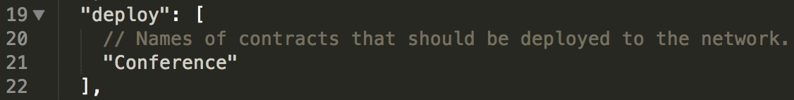
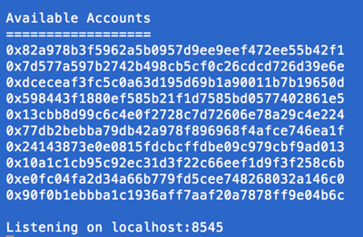

# A 101 Noob Intro to Programming Smart Contracts on Ethereum

[Original Post](http://consensys.github.io/developers/articles/101-noob-intro/) by Eva, With help from Consensys devs

_Some people say Ethereum is too logic-heavy and hard to use, but here’s a write-up to give you a feel for building smart contracts and applications with it. Tools, wallets, applications and the ecosystem are still in development and it’ll get easier!_

?? logic-heavy
_有人说以太坊既重逻辑又难用，因此我们(译注：指[Consensys](http://consensys.net), 下同)写了这篇文章来帮助大家学习如何利用以太坊编写智能合约和应用。这里所用到的工具，钱包，应用程序以及整个生态系统仍处于开发状态，它们将来会更加好用！_

* Part I is an overview of key terms and discusses Ethereum Clients and Smart Contract Languages.
* Part II discusses overall workflow and some current DApp Frameworks and Tools and
* Part III is a the Programming Part, a quick walkthrough of writing tests and building a DApp for a smart contract using Truffle.

* [第一部分](#第一部分. 概述)概述，讨论了关键概念，几大以太坊客户端以及写智能合约用到的编程语言。
* [第二部分](#第二部分. DApp框架，工具以及工作流程)讨论了总体的工作流程，以及目前流行的一些DApp框架和工具。
* [第三部分](#第三部分. 编程)主要关于编程，我们将学习如何使用Truffle来为智能合约编写测试和构建DApp。

## Part I. Intro
## 第一部分. 概述

If you’re new to all this cryptocurrency stuff, including Bitcoin and how it works, check out the first couple chapters of Andreas Antonopoulos’ Bitcoin Book to dip your toe in the water. Then head over to the Ethereum Whitepaper.

如果你对诸如比特币以及其工作原理等密码学货币的概念完全陌生，我们建议你先看看Andreas Antonopoulos所著的[Bitcoin Book](https://github.com/aantonop/bitcoinbook)的头几章，然后读一下[以太坊白皮书](https://github.com/ethereum/wiki/wiki/White-Paper)。(译注：以太坊白皮书中文版请看 http://ethfans.org/posts/ethereum-whitepaper)

If you start getting into some murky sections and would rather build something to get familiar first, then just read on. You don’t have to understand all the crypto economic computer science to start building, and a lot of that paper is about Ethereum’s improvements over Bitcoin’s architecture.

如果你觉得白皮书中的章节太晦涩，也可以直接动手来熟悉以太坊。在以太坊上做开发并不要求你理解所有那些“密码经济计算机科学”(crypto economic computer science)，而白皮书的大部分是关于以太坊想对于比特币架构上的改进。(译者受不了了注：那你写这么多干嘛！#@*&*$~!!！)

### Starter Tutorials
### 新手教程

The official place to start is ethereum.org which has a starter tutorial with follow-up token and crowdsale tutorials. There’s also the official Solidity docs. Another good place to start with smart contracts (where I started) is dappsForBeginners, although it might be outdated.

[ethereum.org](http://ethereum.org)提供了官方的新手入门教程，以及一个代币合约和众筹合约的教程。合约语言Solidity也有[官方文档](https://ethereum.github.io/solidity/)。学习智能合约的另一份不错的资料（也是我的入门资料）是[dappsForBeginners](https://dappsforbeginners.wordpress.com/)，不过现在可能有些过时了。

The goal of this write-up is complement those tutorials and introduce some basic developer tools that make starting out with Ethereum, smart contracts and building DApps (decentralized apps) easier. And to try to explain the overall flow of what’s going on. This is from my (still-noob) perspective and with much help from the cool developers at ConsenSys.

这篇文章的目的是成为上述资料的补充，同时介绍一些基本的开发者工具，使入门以太坊，智能合约以及构建DApps(decentralized apps, 分布式应用)更加容易。我会试图按照我自己(依然是新手)的理解来解释工作流程中的每一步是在做什么，我也得到了ConsenSys酷酷的开发者们的许多帮助。

### Basic Concepts
### 基本概念

It’d be good to know some of these terms:
了解这些名词是一个不错的开始：

**Public Key Cryptography.** Alice has a public key and private key. She can use her private key to create a digital signature, and Bob can use Alice’s public key to verify that a signature is really from Alice’s private key, i.e., really from Alice. When you create an Ethereum or Bitcoin wallet the long ‘0xdf…5f’ address is a public key and the private key is stored somewhere. A Bitcoin wallet service like Coinbase stores your wallet’s complementary private key for you, or you can store it yourself. If you lose your private key for a wallet with real funds you’ll lose all your funds forever, so it’s good to back up your keys. It hurts to learn this the hard way! I’ve done it.

**公钥加密系统。** Alice有一把公钥和一把私钥。她可以用她的私钥创建数字签名，而Bob可以用她的公钥来验证这个签名确实是用Alice的私钥创建的，也就是说，确实是Alice的签名。当你创建一个以太坊或者比特币钱包的时候，那长长的`0xdf...5f`地址实质上是个公钥，对应的私钥保存某处。类似于Coinbase的在线钱包可以帮你保管私钥，你也可以自己保管。如果你弄丢了存有资金的钱包的私钥，你就等于永远失去了那笔资金，因此你最好对私钥做好备份。过来人表示：通过踩坑学习到这一点是非常痛苦的...

**Peer-to-Peer Networking.** Like BitTorrent, all Ethereum nodes are peers in a distributed network, there’s no centralized server. [In the future, there’ll be hybrid semi-centralized services for Ethereum as a convenience to users and developers, more on that later.]

**点对点网络。** 就像BitTorrent, 以太坊分布式网络中的所有节点都地位平等，没有中心服务器。(未来会有半中心化的混合型服务出现为用户和开发者提供方便，这我们后面会讲到。)

**Blockchain.** Like a global ledger or simple database of all transactions, the entire history of all transactions on the network.
**区块链。** 区块链就像是一个全球唯一的帐簿，或者说是数据库，记录了网络中所有交易历史。

**Ethereum Virtual Machine.** So you can write more powerful programs than on top of Bitcoin. It refers to the blockchain, what executes smart contracts, everything.
**以太坊虚拟机(EVM)。** 它让你能在以太坊上写出更强大的程序（比特币上也可以写脚本程序）。它有时也用来指以太坊区块链，负责执行智能合约以及一切。

**Node.** Using this to mean you can run a node and through it read and write to the Ethereum blockchain, i.e., use the Ethereum Virtual Machine. A full node has to download the entire blockchain. Light nodes are possible but in the works.

**节点。** 你可以运行节点，通过它读写以太坊区块链，也即使用以太坊虚拟机。完全节点需要下载整个区块链。轻节点仍在开发中。

**Miner.** A node on the network that mines, i.e., works to process blocks on the blockchain. You can see a partial list of live Ethereum miners here: stats.ethdev.com.

**矿工。** 挖矿，也就是处理区块链上的区块的节点。这个网页可以看到当前活跃的一部分以太坊矿工：[stats.ethdev.com](http://stats.ethdev.com)。

**Proof of Work.** Miners compete to do some math problem. The first one to solve the problem (the next block on the Blockchain) wins a reward: some ether. Every node then updates to that new block. Every miner wants to win the next new block so are incentivized to keep up to date and have the one true blockchain everybody else has, so the network always achieves consensus. [Note: Ethereum is planning to move to a Proof of Stake system without miners eventually, but that’s beyond noob scope.]

**工作量证明。** 矿工们总是在竞争解决一些数学问题。第一个解出答案的(算出下一个区块)将获得以太币作为奖励。然后所有节点都更新自己的区块链。所有想要算出下一个区块的矿工都有与其他节点保持同步，并且维护同一个区块链的动力，因此整个网络总是能达成共识。(注意：以太坊正计划转向没有矿工的权益证明系统(POS)，不过那不在本文讨论范围之内。)

**Ether.** Or ETH for short. It’s a real digital currency you can buy and use! Here’s a chart from one of several exchanges for it. At the time of writing, 1 ETH is worth about 65 cents in USD.

**以太币。** 缩写ETH。一种你可以购买和使用的真正的数字货币。这里是可以交易以太币的其中一家交易所的[走势图](https://poloniex.com/exchange#usdt_eth)。在写这篇文章的时候，1个以太币价值65美分。

**Gas.** Running and storing things on Ethereum costs small amounts of ether. Keeps things efficient.

**Gas. (汽油)** 在以太坊上执行程序以及保存数据都要消耗一定量的以太币，Gas是以太币转换而成。这个机制用来保证效率。

**DApp.** Decentralized App, what applications using smart contracts are called in the Ethereum community. The goal of a DApp is (well, should be) to have a nice UI to your smart contracts plus any extra niceties like IPFS (a neat way to store and serve stuff in a decentralized network, not made by Ethereum but a kindred spirit). While DApps can be run from a central server if that server can talk to an Ethereum node, they can also be run locally on top of any Ethereum node peer. [Take a minute: unlike normal webapps, DApps may not be served from a server. They may use the blockchain to submit transactions and retrieve data (important data!) rather than a central database. Instead of a typical user login system, users may be represented by a wallet addresses and keep any user data local. Many things can be architected differently from the current web.]

**DApp.** 以太坊社区把基于智能合约的应用称为去中心化的应用程序(Decentralized App)。DApp的目标是(或者应该是)让你的智能合约有一个友好的界面，外加一些额外的东西，例如IPFS（可以存储和读取数据的去中心化网络，不是出自以太坊团队但有类似的精神)。DApp可以跑在一台能与以太坊节点交互的中心化服务器上，也可以跑在任意一个以太坊平等节点上。(花一分钟思考一下：与一般的网站不同，DApp不能跑在普通的服务器上。他们需要提交交易到**区块链**并且从**区块链**而不是中心化数据库读取**重要**数据。相对于典型的用户登录系统，用户有可能被表示成一个钱包地址而其它用户数据保存在本地。许多事情都会与目前的web应用有不同架构。)

For another noob angle on some of the concepts above here’s a good read: Just Enough Bitcoin for Ethereum.

如果想看看从另一个新手视角怎么理解这些概念，请读[Just Enough Bitcoin for Ethereum](https://medium.com/@ConsenSys/time-sure-does-fly-ed4518792679)。

### Ethereum Clients, Smart Contract Languages
### 以太坊客户端，智能合约语言

You don’t have to run an Ethereum node to write and deploy smart contracts. See Browser-based IDEs and APIs below. But if you’re learning, run an Ethereum node, it’s good to get to know as a basic component and not hard to set up.

编写和部署智能合约并不要求你运行一个以太坊节点。下面有列出[基于浏览器的IDE和API](#browser_ides)。但如果是为了学习的话，还是应该运行一个以太坊节点，以便理解其中的基本组件，何况运行节点也不难。

#### Clients for Running an Ethereum Node
#### 运行以太坊节点可用的客户端

Ethereum has several different client implementations (meaning ways to run a node to interact with the Ethereum network) including C++, Go, Python, Java, Haskell, etc. Why? Different strokes for different folks (like how the Haskell one is supposedly mathematically verifiable), and it improves the security and ecosystem of Ethereum to have so many. There’s also a gui-based client in development, AlethZero.

以太坊有许多不同语言的客户端实现（即多种与以太坊网络交互的方法），包括C++, Go, Python, Java, Haskell等等。为什么需要这么多实现？不同的实现能满足不同的需求（例如Haskell实现的目标是可以被数学验证），能使以太坊更加安全，能丰富整个生态系统。

At the time of writing, I’ve been using geth, the Go language one (go-ethereum) and on other days a tool called testrpc that uses the Python client, pyethereum. The later examples will involve those tools.

在写作本文时，我使用的是Go语言实现的客户端geth ([go-ethereum](http://ethereum.github.io/go-ethereum/))，其他时候还会使用一个叫testrpc的工具, 它使用了Python客户端[pyethereum](https://github.com/ethereum/pyethereum)。后面的例子会用到这些工具。

[Sidebar: I’ve also tried the C++ one and still use its ethminer component for mining along with geth as the node, so different pieces can work together. Sidebar on Mining: Mining can be fun, sort of like having a houseplant you tend to, and another way to learn about the ecosystem….even if the price of ETH right now is not worth the local electricity costs of mining, that may change. Especially if you start building cool DApps and Ethereum becomes more popular.]

注: 我曾经使用过C++的客户端，现在仍然在用其中的ethminer组件和geth配合挖矿，因此这些不同的组件是可以一起工作的。
关于挖矿：挖矿很有趣，有点像精心照料你的室内盆栽，同时又是一种了解整个系统的方法。虽然以太币现在的价格可能连电费都补不齐，但以后谁知道呢。人们正在创造许多酷酷的DApp, 可能会让以太坊越来越流行。

Interactive Console. Once you have a node using one of the clients, you can sync with the blockchain, create wallets and send and receive real ether. One way to do that with geth is through the JavaScript console. Another way is via JSON RPC (remote procedure calls) using a command like cURL for getting stuff via URLs. However the goal of this article is to walk you through a DApp development scenario so let’s just move on. But these tools are good to remember for debugging, configuring nodes and using a wallet via command line.

**交互式控制台。** 客户端运行起来后，你就可以同步区块链，建立钱包，收发以太币了。使用geth的一种方式是通过[Javascript控制台](https://github.com/ethereum/go-ethereum/wiki/JavaScript-Console)（JavaScript console, 类似你在chrome浏览器里面按F12出来的那个，只不过是跑在终端里）。此外还可以使用类似cURL的命令通过[JSON RPC](https://github.com/ethereum/wiki/wiki/JSON-RPC)来与客户端交互。本文的目标是带大家过一边DApp开发的流程，因此这块就不多说了。但是我们应该记住这些命令行工具是调试，配置节点，以及使用钱包的利器。

Running a node on a test network. If you install a client like geth and run it on the live network, it will take a while to download the entire blockchain and sync with the network. (You can check that it’s synced by seeing that you have the latest block which is listed at the top of stats.ethdev.com and comparing that number to the block number output by your client node’s logs.)

However to run smart contracts on the live network you’d have to cough up some real ether. Instead there are ways to run clients on a local testnet for for free. They won’t download the full blockchain and will create a private instance of the Ethereum network with its own blockchain, so are faster to use for development.

**在测试网络运行节点。** 如果你在正式网络运行geth客户端，下载整个区块链与网络同步会需要相当时间。（你可以通过比较节点日志中打印的最后一个块号和[stats.ethdev.com](http://stats.ethdev.com)上列出的最新块来确定是否已经同步。) 另一个问题是在正式网络上跑智能合约需要实实在在的以太币。在测试网络上运行节点的话就没有这个问题。此时也不需要同步整个区块链，创建一个自己的私有链就勾了，对于开发来说更省时间。

testrpc. You can run a test network using geth, or another fast way of getting a testnet running is using testrpc. Testrpc will create a bunch of pre-funded accounts for you that will be listed when it starts up. It’s is also super fast, so easier to develop and test with. You can start with testrpc, then when your contracts are in good shape, move to geth on a testnet, which can be started by specifying a networkid like: geth --networkid “12345”. Here’s the testrpc repo but I’ll review everything you need to install again in the tutorial part later.

**testrpc.** 用geth可以创建一个测试网络，另一种更快的创建测试网络的方法是使用testrpc. Testrpc可以在启动时帮你创建一堆存有资金的测试账户。它的运行速度也更快因此更适合开发和测试。你可以从testrpc起步，然后随着合约慢慢成型，转移到geth创建的测试网络上 - 启动方法很简单，只需要指定一个networkid：`geth --networkid "12345"`。这里是[testrpc的代码仓库](https://github.com/ConsenSys/eth-testrpc)，下文我们还会再讲到它。

Let’s talk about programming languages next, then we can dive into actually coding stuff.

接下来我们来谈谈可用的编程语言，之后就可以开始真正的编程了。

#### Programming Languages for Smart Contracts
#### 写智能合约用的编程语言

Just use Solidity. To write smart contracts there are a few different languages: Solidity, which is like JavaScript and has .sol as a file extension, Serpent, Python-like with extension .se, and a 3rd, LLL, based on Lisp. Serpent was popular a while back but Solidity is the most popular right now and more robust, so just use Solidity. You prefer Python? Use Solidity.

**用Solidity就好。** 要写智能合约有好几种语言可选：有点类似Javascript的Solidity, 文件扩展名是`.sol`. 和Python接近的Serpent, 文件名以`.se`结尾。还有类似Lisp的LLL。Serpent曾经流行过一段时间，但现在最流行而且最稳定的要算是Solidity了，因此用Solidity就好。听说你喜欢Python? 用Solidity。

solc Compiler. After writing a contract in Solidity, use solc to compile it. It’s from the C++ libraries (different implementations complementing each other again) which can be installed here. [If you don’t want to install solc you can also just use a browser-based compiler like the Solidity real-time compiler or Cosmo, but the programming part later on will assume you have solc installed.]

**solc编译器。** 用Solidity写好智能合约之后，需要用solc来编译。它是一个来自C++客户端实现的组件（又一次，不同的实现产生互补），[这里](https://github.com/ethereum/webthree-umbrella/wiki)是安装方法。如果你不想安装solc也可以直接使用基于浏览器的编译器，例如[Solidity real-time compiler](https://chriseth.github.io/browser-solidity/)或者[Cosmo](http://cosmo.to/)。后文有关编程的部分会假设你安装了solc。

[Note: Ethereum’s libraries are undergoing active development and sometimes things get out of sync with new versions. Make sure you have the latest dev version, or a stable version. Ask in one of the Ethereum Gitter’s on Github or forums.ethereum.org what version people are using if things that used to work stop working.]

注意：以太坊正处于积极的开发中，有时候新的版本之间会有不同步。确认你使用的是最新的dev版本，或者稳定版本。如果遇到问题可以去以太坊项目对应的Gitter聊天室或者[forums.ethereum.org](http://forums.ethereum.org)上问问其他人在用什么版本。

web3.js API. Once a Solidity contract is compiled with solc and sent to the network, you can call it using the Ethereum web3.js JavaScript API and build web apps that interact with contracts. (No need to install this yet, read up on DApp Frameworks below first.)

**web3.js API.** 当Solidity合约编译好并且发送到网络上之后，你可以使用以太坊的[web3.js JavaScript API](https://github.com/ethereum/wiki/wiki/JavaScript-API)来调用它，构建能与之交互的web应用。

Those are the basic Ethereum tools for coding smart contracts and interacting with them to build DApps.

以上就是在以太坊上编写智能合约和构建与之交互的DApp所需的基本工具。

## Part II. DApp Frameworks, Tools and Workflow
## 第二部分. DApp框架，工具以及工作流程

### DApp-building Frameworks
### DApp开发框架

You can do all these steps with just the tools mentioned above, but some helpful devs have created DApp frameworks to make development easier.

虽然有上文提到的工具就可以进行开发了，但是使用社区大神们创造的框架会让开发更容易。

Trufle and Embark. The one that got me started is Truffle. (Before Truffle I watched a group of smart student interns last summer code stuff for a sleepless hackathon (albeit with terrific results) and shrank back in fear. Then Truffle came along and did a lot of the nitty gritty stuff for you, so you can start writing-compiling-deploying-testing-building DApps right away.) Another very similar framework for building and testing DApps is Embark. Between those two, I’ve only used Truffle, but there are very successful DApp devs in both camps.

**Truffle and Embark.** 是[Truffle](https://github.com/ConsenSys/truffle)把我领进了门。在Truffle出现之前的那个夏天，我目睹了一帮有天分的学生是如何不眠不休的参加一个hackathon（编程马拉松）活动的，虽然[结果相当不错](https://www.youtube.com/watch?v=TJBHTT88I8k)，但我还是吓到了。然后Truffle出现了，帮你处理掉大量无关紧要的小事情，让你可以迅速进入写代码-编译-部署-测试-打包DApp这个流程。另外一个相似的DApp构建与测试框架是[Embark](https://iurimatias.github.io/embark-framework)。我只用过Truffle, 但是两个阵营都拥有不少DApp大神。

Meteor. Another stack a lot of DApp devs use include web3.js + Meteor which is a general webapp framework (The ethereum-meteor-wallet repo has a good starter example, and SilentCiero is building a lot of Meteor integrations with web3.js and DApp boilerplates). I’ve downloaded and run cool DApps that do things this way. There’ll be some interesting discussion of all of these tools and best practices for building DApps at Ethereum’s ÐΞVCON1 conference Nov. 9-13th (which will also be streamed or on YouTube).

**Meteor.** 许多DApp开发者使用的另一套开发栈由web3.js和[Meteor](https://www.meteor.com/)组成，Meteor是一套通用webapp开发框架（[ethereum-meteor-wallet](https://github.com/ethereum/meteor-dapp-wallet)项目提供了一个很棒的入门实例，而[SilentCiero](https://github.com/SilentCicero)正在构建大量Meteor与web3.js和DApp集成的模板）。我下载并运行过一些不错的DApp是以这种方式构造的。在11月9日至13日的[以太坊开发者大会ÐΞVCON1](http://consensys.github.io/developers/articles/101-noob-intro/devcon.ethereum.org)上将有一些有趣的讨论，是关于使用这些工具构建DApp以及相关最佳实践的（会议将会在[YouTube](https://www.youtube.com/channel/UC6rYoXJ_3BbPyWx_GQDDRRQ)上直播）。

APIs. BlockApps.net is creating a RESTful API for DApps based on a Haskell node they run as a centralized service to save you the trouble of running a local Ethereum node. This departs from the completely decentralized model of DApps but is useful when running an Ethereum node locally isn’t realistic. For example if you want to serve your DApp to users who won’t be running local nodes either and reach a wider audience with just a web browser or mobile device. BlockApps has a command line tool called bloc in the works that can be used after creating a developer account with them.

**APIs.** [BlockApps.net](http://blockapps.net/)打算提供一套RESTful API给DApp使用以免去开发者运行本地节点的麻烦，这个中心化服务是基于以太坊Haskell实现的。这与DApp的去中心化模型背道而驰，但是在本地无法运行以太坊节点的场合非常有用，比如在你希望只有浏览器或者使用移动设备的用户也能使用你的DApp的时候。BlockApps提供了一个命令行工具[bloc](https://github.com/blockapps/bloc)，注册一个开发者帐号之后就可以使用。

If users have to run a local Ethereum node to use DApps isn’t that a dealbreaker? Like BlockApps there are a range of tools in development so this won’t be. Metamask lets you run Ethereum stuff in a browser without a node, Ethereum’s AlethZero or AlethOne are easier-to-use GUI clients being developed and a LightWallet ConsenSys is building are ways to make interacting with DApps more painless. Light (SPV) nodes and sharding are also in the works or planned. It’s a P2P ecosystem but can involve hybrid architectures.

许多人担心需要运行以太坊节点才能使用DApp的话会把用户吓跑，其实包括BlockApps在内的许多工具都能解决这个问题。[Metamask](https://metamask.io/)允许你在浏览器里面使用以太坊的功能而无需节点，以太坊官方提供的AlethZero或者AlethOne是正在开发中有易用界面的客户端，ConsenSys正在打造一个轻钱包[LightWallet](https://github.com/ConsenSys/eth-lightwallet)，这些工具都会让DApp的使用变得更容易。[轻客户端](https://github.com/ethereum/wiki/wiki/White-Paper#scalability)和水平分片(sharding)也在计划和开发之中。这是一个能进化出混合架构的P2P生态系统。

### Smart Contract IDEs
### 智能合约集成开发环境 (IDE)

IDEs.There’s a Mix IDE for writing contracts put out by Ethereum. Haven’t tried it but will soon.

**IDE.** 以太坊官方出品了用来编写智能合约的[Mix IDE](https://github.com/ethereum/wiki/wiki/Mix:-The-DApp-IDE)，我还没用过但会尽快一试。

Browser-based IDEs. The Solidity real-time compiler and Cosmo are both a fast way to get started compiling your smart contracts right away in a browser. You can even point your local node at these hosted instances by opening up a port (you should trust the site and not have your life savings in ether on your local node for that! See the Cosmo UI for instructions on how to do this with geth). But once your contract is working ok it’s nice to use a framework for adding a UI and packaging it all up as a DApp, which is what Truffle does and will be explained in the programming part later.

**基于浏览器的IDE.** [Solidity real-time compiler](https://chriseth.github.io/browser-solidity)和[Cosmo](http://cosmo.to/)都可以让你快速开始在浏览器中编写智能合约。你甚至可以让这些工具使用你的本地节点，只要让本地节点开一个端口（注意安全！这些工具站点必须可信，而且千万不要把你的全部身家放在这样一个本地节点里面！[Cosmo UI](http://cosmo.to/)上有如何使用geth做到这一点的指引）。在你的智能合约调试通过之后，可以用开发框架来给它添加用户界面和打包成DApp，这正是Truffle的工作，后面的编程章节会有详细讲解。

Another powerful enterprise-y browser IDE is in the works by Ether.Camp. Their IDE comes with a sandbox test network with an auto-generated GUI for testing (instead of writing tests manually as shown in the tutorial later) as well as a sandbox transaction explorer at test.ether.camp. When you’re ready to deploy your contract for semi-real, using their testnet can a good way to confirm your smart contract’s working as expected on a closer-to-real testbed. The same explorer for the live Ethereum network is at frontier.ether.camp and it shows details about every transaction ever. Ether.Camp’s IDE is invite-only for eager guinea pigs at time of writing but will be launched soon.

[Ether.Camp](http://frontier.ether.camp/)正在开发另一个强大的企业级浏览器IDE。他们的IDE将支持沙盒测试网络，自动生成用于测试的用户界面（取代后文将展示的手动编写测试），以及一个测试交易浏览器[test.ether.camp](http://test.ether.camp/)。当你的合约准备正式上线之前，使用他们的测试网络会是确保你的智能合约在一个接近真实的环境工作正常的好方法。他们也为正式网络提供了一个交易浏览器[frontier.ether.camp](http://frontier.ether.camp/)，上面可以看到每一笔交易的细节。在本文写作时Ether.Camp的IDE还只能通过邀请注册，预计很快会正式发布。

Sample Contracts and DApps. Search Github for DApp repos and .sol files to see what cool stuff people do and how. A big list of DApps with repos is also here: dapps.ethercasts.com, although some of the list’s details are a little out of date. Ether.fund/contracts also has some examples of Solidity and Serpent contracts people have written, but not sure if these have been tested or verified for correctness. There’ll be a whole day of DApp presentations Thursday, Nov. 12th at ÐΞVCON1.

**合约和Dapp示例。** 在Github上搜索DApp仓库和.sol文件可以看到进行中的有趣东西。这里有一个DApp大列表：[dapps.ethercasts.com](http://dapps.ethercasts.com/)，不过其中一些项目已经过时。[Ether.fund/contracts](http://ether.fund/contracts)上有一些Solidity和Serpent写的合约示例，但是不清楚这些例子有没有经过测试或者正确性验证。11月12日的[开发者大会ÐΞVCON1](https://devcon.ethereum.org/)将会有一整天的DApp主题演讲。

### Workflow for Deploying Smart Contracts
### 部署智能合约的流程

The workflow is:

流程如下：

1. Start an Ethereum node (e.g. geth or testrpc)
2. Compile your Solidity smart contract using solc => get back the binary
3. Deploy your compiled contract to the network. (This step costs ether and signs the contract using your node’s default wallet address, or you can specify another address.) => get back the contract’s blockchain address and ABI (a JSON-ified representation of your compiled contract’s variables, events and methods that you can call)
4. Call stuff in the contract using web3.js’s JavaScript API to interact with it (This step may cost ether depending on the type of invocation.)
This workflow is depicted in greater detail in the diagram below:

1. 启动一个**以太坊节点** (例如geth或者testrpc)。
2. 使用solc**编译**智能合约。 => 获得二进制代码。
3. 将编译好的合约**部署**到网络。（这一步会消耗以太币，还需要使用你的节点的默认地址或者指定地址来给合约签名。） => 获得合约的区块链地址和ABI（合约接口的JSON表示，包括变量，事件和可以调用的方法）。(译注：作者在这里把ABI与合约接口弄混了。ABI是合约接口的二进制表示。)
4. 用web3.js提供的JavaScript API来**调用**合约。（根据调用的类型有可能会消耗以太币。）

This workflow is depicted in greater detail in the diagram below:

下图详细描绘了这个流程：


You could build a DApp that provides a UI for users to deploy a contract then use it (Steps 1 or 4). Or your DApp could assume the contract’s already been deployed (common) and start the UI flow from there (Step 6).

你的DApp可以给用户提供一个界面先部署所需合约再使用之（如图1到4步），也可以假设合约已经部署了（常见方法），直接从使用合约（如图第6步）的界面开始。

## Part III. The Programming Part, Finally
## 第三部分. 编程

### Testing in Truffle
### 在Truffle中进行测试

Truffle is great for test-driven development of smart contracts which is highly recommended to maintain sanity when you’re starting to learn how things work. It’s also useful as a way to learn to write promises in JavaScript, i.e., deferred and asynchronous callbacks. Promises are like “do this, then when that comes back, do that, and when that comes back, do this other thing…and don’t keep us waiting while all that’s going on, ok?” Truffle uses a JS promises framework called Pudding on top of web3.js (so it installs web3.js for you too).

[Truffle](https://github.com/consensys/truffle)用来做智能合约的测试驱动开发(TDD)非常棒，我强烈推荐你在学习中使用它。它也是学习使用JavaScript Promise的一个好途径，例如deferred和异步调用。Promise机制有点像是说“做这件事，如果结果是这样，做甲，如果结果是那样，做乙... 与此同时不要在那儿干等着结果返回，行不？”。Truffle使用了包装web3.js的一个JS Promise框架[Pudding](https://github.com/ConsenSys/ether-pudding)（因此它为为你安装web3.js）。(译注：Promise是流行于JavaScript社区中的一种异步调用模式。它很好的封装了异步调用，使其能够灵活组合，而不会陷入callback hell.)

Transaction times. Promises are extremely useful for DApps because transactions need to be mined into the blockchain (takes 12-15 seconds in Ethereum). Even if they don’t seem to take that long on a test network it may take longer on the live network, or to find out it didn’t happen (e.g. your transaction could have ran out of gas, or was mined into a block that’s been orphaned).

**Transaction times.** Promise对于DApp非常有用，因为交易写入以太坊区块链需要大约12-15秒的时间。即使在测试网络上看起来没有那么慢，在正式网络上却可能会要更长的时间（例如你的交易可能用光了Gas，或者被写入了一个孤儿块）。

So let’s copy a simple smart contract and write a test for it.

下面让我们给一个简单的智能合约写测试用例吧。

### Using Truffle
### 使用Truffle

Make sure you have 1. solc installed and 2. testrpc. (For testrpc you’ll need Python and pip. If you’re new to Python, to install it you may also need to use a virtualenv, a way to keep python libraries separate on a single computer.)

首先确保你 1.安装好了[solc](https://github.com/ethereum/webthree-umbrella/wiki)以及 2.[testrpc](https://github.com/ConsenSys/eth-testrpc)。（testrpc需要[Python](https://www.python.org/downloads/)和[pip](https://pip.pypa.io/en/stable/installing/)。如果你是Python新手，你可能需要用[virtualenv](http://docs.python-guide.org/en/latest/dev/virtualenvs/)来安装，这可以将Python程序库安装在一个独立的环境中。）

Install 3. Truffle (You can do this using NodeJS’s npm: npm install -g truffle, the -g may require sudo). To verify it installed, type truffle list in a console window to list all truffle commands. Then create a new project directory (I’m naming my new directory ‘conference’), change into it, and do truffle init. This will create this directory structure:

接下来安装 3.[Truffle](https://github.com/ConsenSys/truffle)（你可以使用[NodeJS's npm](https://docs.npmjs.com/getting-started/installing-node)来安装：`npm install -g truffle`, `-g`开关可能会需要sudo）。安装好之后，在命令行中输入`truffle list`来验证安装成功。然后创建一个新的项目目录（我把它命名为'conference'），进入这个目录，运行`truffle init`。该命令会建立如下的目录结构：


Now start a client node in a new console window by running testrpc (or start your geth node):

现在让我们在**另一个终端**里通过执行`testrpc`来启动一个节点（你也可以用geth）：


Back in the first truffle console window, now type truffle deploy. This will deploy the Example contract truffle init created as boilerplate. Any errors messages you may have will show up in either the testrpc console window or the truffle window.

回到之前的终端中，输入`truffle deploy`。这条命令会部署之前`truffle init`产生的模板合约到网络上。任何你可能遇到的错误信息都会在testrpc的终端或者执行truffle的终端中输出。

As you’re developing you can do truffle compile to make sure your contracts compile (using solc you can also run solc YourContract.sol), truffle deploy to compile and deploy it to the network, and truffle test to run your smart contract tests.

在开发过程中你随时可以使用`truffle compile`命令来确认你的合约可以正常编译（或者使用`solc YourContract.sol`），`truffle deploy`来编译和部署合约，最后是`truffle test`来运行智能合约的测试用例。

### First Contract, First Test
### 第一个合约

Here’s a Solidity contract for a Conference where registrants can buy tickets, and the organizer can set a maximum quota of attendees as well as provide refunds. All the code presented in this tutorial is in this repo.

下面是一个针对会议的智能合约，通过它参会者可以买票，组织者可以设置参会人数上限，以及退款策略。本文涉及的所有代码都可以在这个[代码仓库](https://github.com/eshon/conference)找到。

```
contract Conference {
  address public organizer;
  mapping (address => uint) registrantsPaid;
  uint public numRegistrants;
  uint public quota;

  event Deposit(address _from, uint _amount);  // so you can log these events
  event Refund(address _to, uint _amount); 

  function Conference() { // Constructor
    organizer = msg.sender;
    quota = 500;
    numRegistrants = 0;
  }
  function buyTicket() public returns (bool success) {
    if (numRegistrants >= quota) { return false; }
    registrantsPaid[msg.sender] = msg.value;
    numRegistrants++;
    Deposit(msg.sender, msg.value);
    return true;
  }
  function changeQuota(uint newquota) public {
    if (msg.sender != organizer) { return; }
    quota = newquota;
  }
  function refundTicket(address recipient, uint amount) public {
    if (msg.sender != organizer) { return; }
    if (registrantsPaid[recipient] == amount) { 
      address myAddress = this;
      if (myAddress.balance >= amount) { 
        recipient.send(amount);
        registrantsPaid[recipient] = 0;
        numRegistrants--;
        Refund(recipient, amount);
      }
    }
  }
  function destroy() { // so funds not locked in contract forever
    if (msg.sender == organizer) { 
      suicide(organizer); // send funds to organizer
    }
  }
}
```

接下来让我们部署这个合约。（注意：本文写作时我使用的是Mac OS X 10.10.5, solc 0.1.3+ (通过brew安装)，Truffle v0.2.3, testrpc v0.1.18 (使用venv)）

### Deploying the Contract
### 部署合约


(译注：图中步骤翻译如下：）

使用truffle部署智能合约的步骤：
1. `truffle init` (在新目录中) => 创建truffle项目目录结构
2. 编写合约代码，保存到`contracts/YourContractName.sol`文件。
3. 把合约名字加到`config/app.json`的'contracts'部分。
4. 启动以太坊节点（例如在另一个终端里面运行`testrpc`）。
5. `truffle deploy`（在truffle项目目录中)

**添加一个智能合约。** 在`truffle init`执行后或是一个现有的项目目录中，复制粘帖上面的会议合约到`contracts/Conference.sol`文件中。然后打开`config/app.json`文件，把'Conference'加入'deploy'数组中。



Start testrpc. Start testrpc in a separate console window using testrpc if its not already running.

**启动testrpc。** 在另一个终端中启动`testrpc`。

Compile or Deploy. Run truffle compile to see if the contract compiles, or just do truffle deploy to compile and deploy at once. This will add the deployed contract’s address and ABI(that JSON-ified version of the compiled contract) to the config directory, which truffle test and truffle build will pull in from later on.

**编译或部署。** 执行`truffle compile`看一下合约是否能成功编译，或者直接`truffle deploy`一步完成编译和部署。这条命令会把部署好的合约的地址和ABI（应用接口）加入到配置文件中，这样之后的`truffle test`和`truffle build`步骤可以使用这些信息。

Errors? Did that compile? Again, error messages may show up in either the testrpc console or the truffle console.

**出错了？** 编译是否成功了？记住，错误信息即可能出现在testrpc终端也可能出现在truffle终端。

Redeploy after restarting a node! If you stop your testrpc node, remember to redeploy any contracts using truffle deploy before trying to use them again. Each time testrpc restarts it’s a blank slate. 

**重启节点后记得重新部署！** 如果你停止了testrpc节点，下一次使用任何合约之前切记使用`truffle deploy`重新部署。testrpc在每一次重启之后都会回到完全空白的状态。

### Analyzing the Contract
### 合约代码解读

Let’s start with the variables at the top of the smart contract:

让我们从智能合约头部的变量声明开始：

```
address public organizer;
mapping (address => uint) public registrantsPaid;
uint public numRegistrants;
uint public quota;
```

address. The first variable is the wallet address of the organizer. This is set when the constructor is called in function Conference(). A lot of contracts will also call this the ‘owner’.

**address.** 地址类型。第一个变量是会议组织者的钱包地址。这个地址会在合约的构造函数`function Conference()`中被赋值。很多时候也称呼这种地址为'owner'（所有人）。

uint. An unsigned integer. Space is important on the blockchain so keep things as small as possible.

**uint.** 无符号整型。区块链上的存储空间很紧张，保持数据尽可能的小。

public. Means it can be called from outside the contract. A private modifier would mean it can only be called from within the contract (or by derived contracts). If you’re trying to call a variable from a web3.js call in a test make sure its public.

**public.** 这个关键字表明变量可以被合约之外的对象使用。`private`修饰符则表示变量只能被本合约(或者衍生合约)内的对象使用。如果你想要在测试中通过web3.js使用合约中的某个变量，记得把它声明为`public`。

Mappings or Arrays. Before Solidity added support for arrays, mappings like mapping (address => uint) were used. This could also be written as address registrantsPaid[] but mappings have a smaller footprint. This mapping will be used to store how much each registrant (represented by their wallet address) has paid so they can get refunds later on.

**Mapping或数组。**（译注：Mapping类似Hash, Directory等数据类型，不做翻译。）在Solidity加入数组类型之前，大家都使用类似`mapping (address => uint)`的Mapping类型。这个声明也可以写作`address registrantsPaid[]`，不过Mapping的存储占用更小(smaller footprint)。这个Mapping变量会用来保存参加者（用他们的钱包地址表示）的付款数量以便在退款时使用。

More on addresses. Your client node (i.e., testrpc or geth in these examples) can have one or more accounts. In testrpc, on startup an array of 10 “Available Addresses” are displayed:

**关于地址。** 你的客户端（比如testrpc或者geth）可以生成一个或多个账户/地址。testrpc启动时会显示10个可用地址：



第一个地址, `accounts[0]`，是发起调用的默认地址，如果没有特别指定的话。

Organizer address vs. Contract address. Your deployed contract will have its own contract address (different from the organizer’s address) on the blockchain. This address is accessible in a Solidity contract using this, as used inside the refundTicket function in the contract: address myAddress = this;

**组织者地址 vs. 合约地址。** 部署好的合约会在区块链上拥有自己的地址（与组织者拥有的是不同的地址）。在Solidity合约中可以使用`this`来访问这个合约地址，正如`refundTicket`函数所展示的：`address myAddress = this;`

Suicide, a good thing in Solidity. Funds sent to the contract are held in the contract itself. In the destroy function above funds are finally released to the organizer set in the constructor. suicide(organizer); does this. Without it, funds can end up locked in the contract forever (somebody on reddit lost some ether this way), so make sure to include that method if your contract collects funds!

**Suicide, Solidity的好东西。**（译注：`suicide`意为'自杀', 为Solidity提供的关键字，不做翻译。）转给合约的资金会保存于合约（地址）中。最终这些资金通过`destroy`函数被释放给了构造函数中设置的组织者地址。这是通过`suicide(orgnizer);`这行代码实现的。没有这个，资金可能被永远锁定在合约之中（reddit上有些人就遇到过），因此如果你的合约会接受资金一定要记得在合约中使用这个方法！

If you want to simulate another user or counterparty (e.g. simulate a buyer if you’re a seller), you can use another address from the accounts array. To buy a ticket as a different user, say accounts[1], use it in the from field:

如果想要模拟另一个用户或者对手方（例如你是卖家想要模拟一个买家），你可以使用可用地址数组中另外的地址。假设你要以另一个用户，`accounts[1]`, 的身份来买票，可以通过`from`参数设置：

```
conference.buyTicket({ from: accounts[1], value: some_ticket_price_integer });
```

Some Function Calls can be Transactions. Function calls that change the state of the contract (modify values, add records, etc.) are transactions and have implicit sender and value. So inside curly braces ``{ from: __, value: __ }`` can be specified in a web3.js function call to send funds to a transaction function from a wallet address. On the Solidity end, you can retrieve these values using msg.sender and msg.value, which are implicity in Solidty transaction functions:

**函数调用可以是交易。** 改变合约状态（修改变量值，添加记录，等等）的函数调用本身也是转账交易，隐式的包含了发送人和交易价值。因此web3.js的函数调用可以通过指定`{ from: __, value: __ }`参数来发送以太币。在Solidity合约中，你可以通过`msg.sender`和`msg.value`来获取这些信息：

```
function buyTicket() public {
	...
	registrantsPaid[msg.sender] = msg.value;
	...
}
```

Events. These are totally optional. Deposit and Send in the contract are events that can be logged in the Ethereum Virtual Machine logs. They don’t actually do anything, but are good practice for keeping track that a transaction has happened.

**事件(Event)。** 可选的功能。合约中的`Deposit`（充值）和`Send`（发送）事件是会被记录在以太坊虚拟机日志中的数据。它们实际上没有任何作用，但是用事件(Event)把交易记录进日志是好的做法。

Okay, let’s write a test for this smart contract to make sure it works. 

好了，现在让我们给这个智能合约写一个测试，来确保它能工作。

### Writing a Test
### 写测试

In your project folder’s test/ directory rename the example.js test file to conference.js. Modify all instances of “Example” to “Conference”.

把项目目录`test/`中的`example.js`文件重命名为`conference.js`，文件中所有的'Example'替换为'Conference'。

```
contract('Conference', function(accounts) {
  it("should assert true", function(done) {
    var conference = Conference.at(Conference.deployed_address);
    assert.isTrue(true);
    done();   // stops tests at this point
  });
});
```

On running truffle test from the project’s root directory you should see the test pass. In the test above truffle gets the contract’s address on the blockchain from Conference.deployed_address.

在项目根目录下运行`truffle test`，你应该看到测试通过。在上面的测试中truffle通过`Conference.deployed_address`获得合约部署在区块链上的地址。

Let’s write a test to initialize a new Conference and check that the initial variables are being set correctly. Replace the test in conference.js with this one:

让我们写一个测试来初始化一个新的Conference，然后检查变量都正确赋值了。将`conference.js`中的测试代码替换为：

```
contract('Conference', function(accounts) {
  it("Initial conference settings should match", function(done) {
    var conference = Conference.at(Conference.deployed_address);  
    // same as previous example up to here
    Conference.new({ from: accounts[0]  })
    .then(function(conference) {
      conference.quota.call().then(
          function(quota) {
            assert.equal(quota, 500, "Quota doesn't match!"); 
          }).then( function() {
            return conference.numRegistrants.call();
          }).then( function(num) {
            assert.equal(num, 0, "Registrants should be zero!");
            return conference.organizer.call();
          }).then( function(organizer) {
            assert.equal(organizer, accounts[0], "Owner doesn't match!");
            done();   // to stop these tests earlier, move this up
        }).catch(done);
      }).catch(done);
    });
  });
```

Constructor. Conference.new({ from: accounts[0] }) instantiates a new Conference by calling the contract’s constructor. Since accounts[0] is used by default if no from is specified, so it could have been left out when calling the constructor:

**构造函数。** `Conference.new({ from: accounts[0] })`通过调用合约构造函数创造了一个新的Conference实例。由于不指定`from`时会默认使用`accounts[0]`，它其实可以被省略掉：

```
Conference.new({ from: accounts[0] }); // 和Conference.new()效果相同
```

Promises. That’s what those then and return’s above are. What’s going on above might start to look like a deeply nested function call chain like:

**Promise.** 代码中的那些`then`和`return`就是Promise。它们的作用写成一个深深的嵌套调用链的话会是这样：

```
conference.numRegistrants.call().then(
  function(num) {
    assert.equal(num, 0, "Registrants should be zero!");
    conference.organizer.call().then(
     function(organizer) {
        assert.equal(organizer, accounts[0], "Owner doesn't match!");
        }).then(
          function(...))
            }).then(
              function(...))
            // Because this would get hairy...
```

Promises flatten this to minimize nesting, allow for calls to return asynchronously and help simplify the syntax of writing “on success do this” vs. “on failure do that”. Web3.js provides callbacks for asynchronous requests (docs) so you don’t have to wait for transactions to complete to do stuff in the front-end. (Truffle uses a promises framework wrapper to web3.js called Pudding, based on the framework Bluebird, which also has advanced promise features.)

Promise减少嵌套，使代码变得扁平，允许调用异步返回，并且简化了表达“成功时做这个”和“失败时做那个”的语法。Web3.js通过[回调函数](https://github.com/ethereum/wiki/wiki/JavaScript-API#using-callbacks)实现异步调用，因此你不需要等到交易完成就可以继续执行前端代码。Truffle借助了用Promise封装web3.js的一个框架，叫做[Pudding](https://github.com/ConsenSys/ether-pudding)，这个框架本身又是基于[Bluebird](http://ricostacruz.com/cheatsheets/bluebird.html)的，它支持Promise的高级特性。

call. Use this to check the values of variables as in conference.quota.call().then(... or with an argument like call(0) to call a mapping and get index 0. Solidity docs say this is a “message call” which is 1. not mined and so 2. doesn’t have to be from an account/wallet (therefore it’s not signed with an account holder’s private keys). Transactions on the other hand, are mined, have to be from an account (i.e., signed), and are recorded on the blockchain. Modifying any value in a contract is a transaction. Just checking a variable value is not. So don’t forget to add call() when calling variables! Crazy things can happen. [Also, if you’re trying to call a variable and having problems make sure its public.] call() can also be used to call functions that are not transactions. If they are meant to be transactions and you try to call() them, they won’t execute as transactions on the blockchain.

**call.** 我们使用`call`来检查变量的值，例如`conference.quota.call().then(...`，还可以通过传参数，例如`call(0)`, 来获取mapping在index 0处的元素。Solidity的文档说这是一种特殊的“消息调用”因为 1.不会为矿工记录和 2.不需要从钱包账户/地址发起（因此它没有被账户持有者私钥做签名）。另一方面，交易/事务(Transaction)会被矿工记录，必须来自于一个账户（也就是有签名），会被记录到区块链上。对合约中数据做的任何修改都是交易。仅仅是检查一个变量的值则不是。因此在读取变量时不要忘记加上`call()`！否则会发生奇怪的事情。（此外如果在读取变量是遇到问题别忘记检查它是否是`public`。）`call()`也能用于调用不是交易的函数。如果一个函数本来是交易，但你却用`call()`来调用，则不会在区块链上产生交易。

assert. Standard JS testing assertion (if you type ‘asserts’ plural by accident truffle will have errors and you won’t know what’s going on), see the Chai docs for other types of assertions but assert.equal is usually all you need.

**断言。** 标准JS测试中的断言（如果你不小心拼成了复数形式'asserts'，truffle会报错，让你一头雾水），`assert.equal`是最常用的，其他类型的断言可以在[Chai的文档](http://chaijs.com/api/assert/)中找到。

Run truffle test again to make sure that works for you. )

再一次运行`truffle test`确保一切工作正常。

### Writing a Test calling a Contract Function
### 测试合约函数调用

Let’s test that the function that changes the quota works. Inside the contract('Conference', function(accounts) {...}; body of tests/conference.js stick this additional test:)

现在我们测试一下改变`quote`变量的函数能工作。在`tests/conference.js`文件的`contract('Conference', function(accounts) {...};)`的函数体中添加如下测试用例：

```
it("Should update quota", function(done) {
  var c = Conference.at(Conference.deployed_address);

  Conference.new({from: accounts[0] }).then(
    function(conference) {
      conference.quota.call().then( 
        function(quota) { 
          assert.equal(quota, 500, "Quota doesn't match!"); 
        }).then( function() { 
          return conference.changeQuota(300);
        }).then( function(result) {  // result here is a transaction hash
          console.log(result);  // if you were to print this out it’d be long hex - the transaction hash
          return conference.quota.call()
        }).then( function(quota) { 
          assert.equal(quota, 300, "New quota is not correct!");
          done();
        }).catch(done);
    }).catch(done);
});
```

The new thing is the line that calls the changeQuota function. The console.log is also useful for debugging to print the result in the truffle console’s output. Add a console.log to see if the execution gets to a certain point. Also make sure the changeQuota function in the Solidity contract is public, or you won’t be able to call it:

这里的新东西是调用`changeQuota`函数的那一行。`console.log`对于调试很有用，用它能在运行truffle的终端中输出信息。在关键点插入`console.log`可以查看执行到了哪一步。记得把Solidity合约中`changeQuota`函数被声明为`public`，否则你不能调用它：

```
  function changeQuota(uint newquota) public {  }
```

### Writing a Test for a Transaction
### 测试交易

Let’s call a function that expects funds from a wallet address.

现在让我们调用一个需要发起人发送资金的函数。

Wei. Ether has a lot of denominations (here’s a helpful converter) and the one normally used in contracts is Wei, the smallest. Web3.js provides convenience methods for converting ether to/from Wei, as in web3.toWei(.05, 'ether'). JavaScript has issues with very big numbers so web3.js uses a BigNumber library and they recommend keeping things in Wei in your code until users see it (docs).

**Wei.** 以太币有很多种单位（这里有个很有用的[转换器](http://ether.fund/tool/converter)）,在合约中通常用的是Wei，最小的单位。Web3.js提供了在各单位与Wei之间互相转换的便利方法，形如`web3.toWei(.05, 'ether')`。JavaScript在处理很大的数字时有问题，因此web3.js使用了[程序库BigNumber](https://github.com/MikeMcl/bignumber.js/)，并建议在代码各处都以Wei做单位，直到要给用户看的时候（[文档](https://github.com/ethereum/wiki/wiki/JavaScript-API#a-note-on-big-numbers-in-web3js)。

Account Balances. Web3.js provides a lot more convenience methods here, and another one used in the test below is web3.eth.getBalance(some_address). Remember that funds sent to the contract are in the contract itself until suicide is called.

**账户余额。** Web3.js提供了许多提供方便的[方法](https://github.com/ethereum/wiki/wiki/JavaScript-API#web3-javascript-%C3%90app-api-reference)，其中另一个会在下面测试用到的是`web3.eth.getBalance(some_address)`。记住发送给合约的资金会由合约自己持有直到调用`suicide`。

Inside the contract(Conference, function(accounts) {...}; body stick this additional test. In the highlighted method below, the test has a second user (accounts[1]) buy a ticket for ticketPrice. Then it checks that the contract’s balance has increased by the ticketPrice sent and that the second user has been added to the list of registrants.

在`contract(Conference, function(accounts) {...};)`的函数体中插入下面的测试用例。在高亮显示的方法中，测试用例让另一个用户(`accounts[1]`)以`ticketPrice`的价格买了一张门票。然后它检查合约的账户余额增加了`ticketPrice`，以及购票用户被加入了参会者列表。

In this test buyTicket is a Transaction:)

这个测试中的`buyTicket`调用是一个交易：

```
it("Should let you buy a ticket", function(done) {
  var c = Conference.at(Conference.deployed_address);

  Conference.new({ from: accounts[0] }).then(
    function(conference) {
      var ticketPrice = web3.toWei(.05, 'ether');
      var initialBalance = web3.eth.getBalance(conference.address).toNumber();

      conference.buyTicket({ from: accounts[1], value: ticketPrice }).then(
        function() {
          var newBalance = web3.eth.getBalance(conference.address).toNumber();
          var difference = newBalance - initialBalance;
          assert.equal(difference, ticketPrice, "Difference should be what was sent");
          return conference.numRegistrants.call();
      }).then(function(num) {
          assert.equal(num, 1, "there should be 1 registrant");
          return conference.registrantsPaid.call(accounts[1]);
      }).then(function(amount) {
          assert.equal(amount.toNumber(), ticketPrice, "Sender's paid but is not listed");
          done();
      }).catch(done);
  }).catch(done);
});
```

Transactions are Signed. Unlike previous function calls this is a transaction sent funds, so under the hood the second user (accounts[1]) is signing the transaction call buyTicket() with their key. (In geth the user would have to enter a password to approve this transaction or unlock their account before sending funds.)

**交易需要签名。** 和之前的函数调用不同，这个调用是一个会发送资金的交易，在这种情况下购票用户(`accounts[1]`)会用他的私钥对`buyTicket()`调用做签名。（在geth中用户需要在发送资金之前通过输入密码来批准这个交易或是解锁钱包的账户。）

toNumber(). Sometimes results from Solidity returned have to be converted from hex. If it might be a really big number go with web3.toBigNumber(numberOrHexString) because Javascript can mess up big numbers. 

**toNumber().** 有时我们需要把Solidity返回的十六进制结果转码。如果结果可能是个很大的数字可以用`web3.toBigNumber(numberOrHexString)`来处理因为JavaScript直接对付大数要糟。
