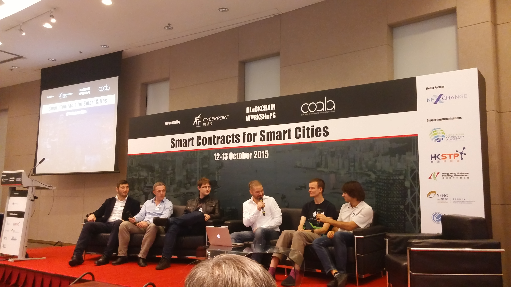

[Origin Post](https://blog.ethereum.org/2015/10/18/vitaliks-research-and-ecosystem-update/)

Posted by Vitalik Buterin on October 18th, 2015.

Over the last five days, myself, our executive director Ming Chan, and several others from the Ethereum team and Ethereum-based projects and businesses including Maker, String/Dfinity and Consensys have been visiting China and Hong Kong, where there have been a series of back-to-back conferences and events most notably including the Blockchain Workshop in Hong Kong on Oct 11-13 and the “First Global Blockchain Summit” in Shanghai organized by our friends at Wanxiang on Oct 15-16, while at the same time continuing to work on our usual tasks of research, development, planning DEVcon and administrative matters.

**过去五天，我，我们的执行主管Ming Chan，还有以太坊, [Maker](http://makerdao.com/), [String/Dfinity](http://dfinity.io/)以及[Consensy](http://consensys.net/)团队中的一些成员参加了在中国大陆和香港举行的一系列会议和活动。其中最重要的要数10月11-13日在香港举行的[Blockchain Workshop](http://blockchainworkshops.org/)，以及由[万向集团](http://www.wanxiang.com.cn/product/index.asp)的朋友们于10月15-16日在上海举办的[首届全球区块链峰会](http://www.hbrchina.org/150922/index.shtml)了。这段时间中包括研究，开发，计划准备开发者大会以及行政性事务在内的日常工作也在正常进行。**

Both conferences proved to be, at least in my own admittedly optimistic estimation, highly positive signs of the growth in the Ethereum ecosystem. At the Hong Kong event, on the first day we participated in semi-closed sessions on issues such as decentralized governance, identity and reputation and regulatory compliance. Robin Hanson brought up the topic of prediction markets as a form of “low-cost micro-governance”: if there are situations where a legal or arbitration process is required in order to ultimately resolve disputes, use a prediction market to provide the result instead, only occasionally escalating to the underlying arbitration mechanism. Anyone with private information has the incentive to participate in the prediction market: the parties to the dispute themselves, any third parties involved, and even firms like Google applying top-of-the-line machine learning algorithms; in most cases, a result that accurately predicts the result that would be obtained by the underlying court or arbitration system should be attainable very cheaply.

从我这个乐观的人看来，这两个会议都证明了以太坊生态系统正在健康成长。在香港的会议的第一天，我们参加了半封闭式的会议，讨论的主题包括去中心化的管理、身份和信誉以及合规问题。罗宾·汉森带来了预测市场作为一种“低成本微管理”形式的主题。“低成本微管理”是指利用预测市场代替法律和仲裁以解决纠纷，只在少数必要情况下升级至仲裁途径。任何拥有私有信息的人都有动机参与预测市场：纠纷双方、任何卷入纠纷的第三方，甚至是像谷歌这样运用一流的机器学习算法的公司。在大多数情况下，预测市场应该能以非常低的成本获得法庭或仲裁系统相同的结果。

